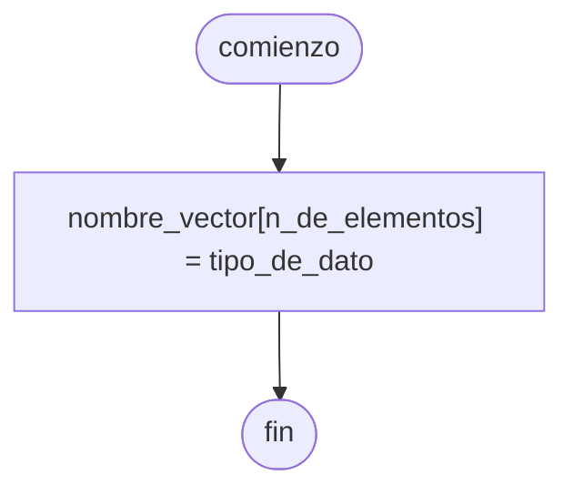
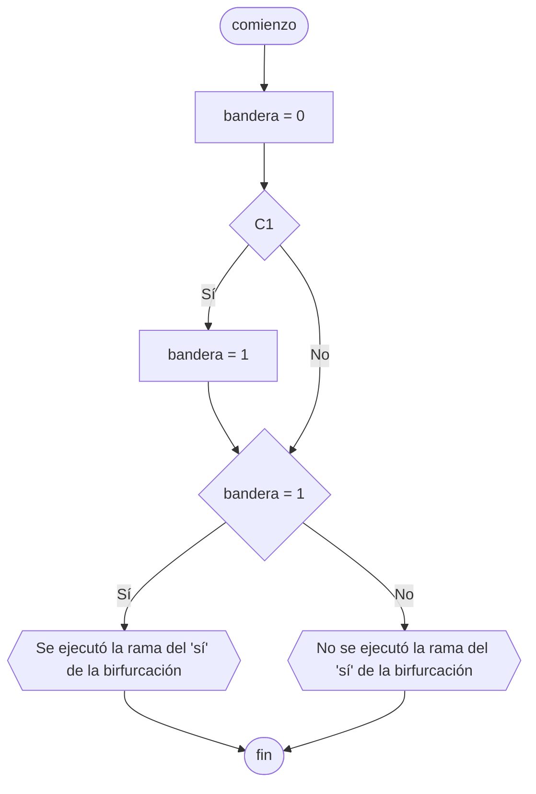
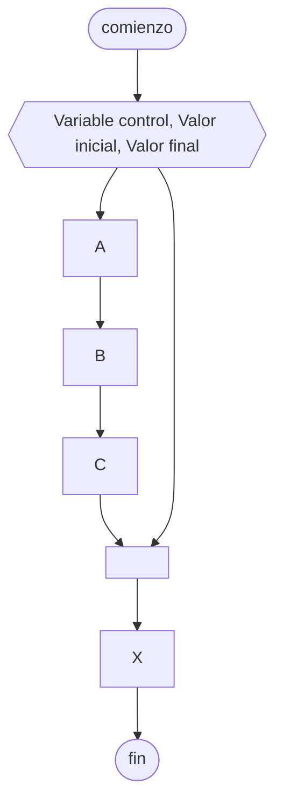
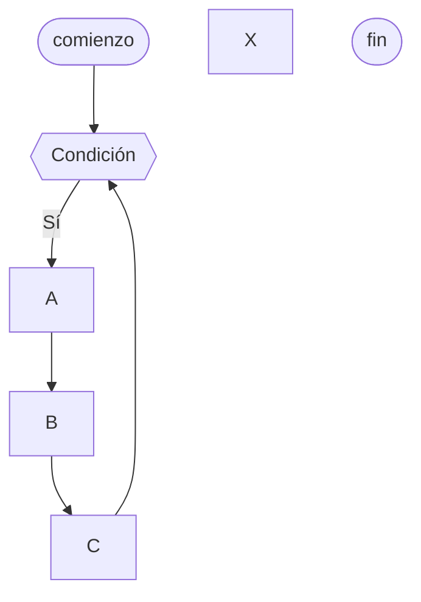
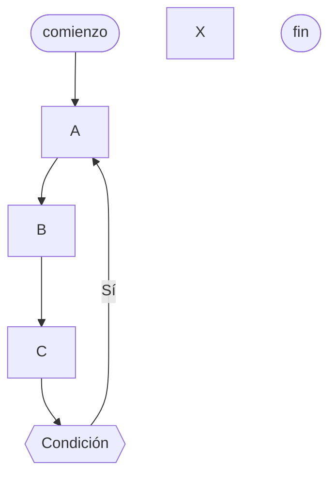
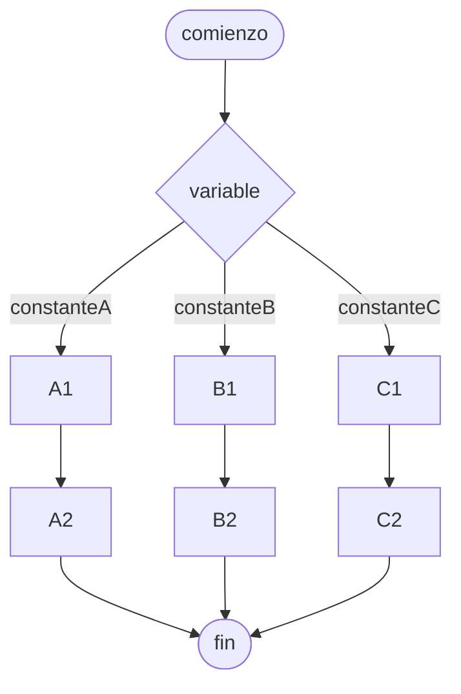
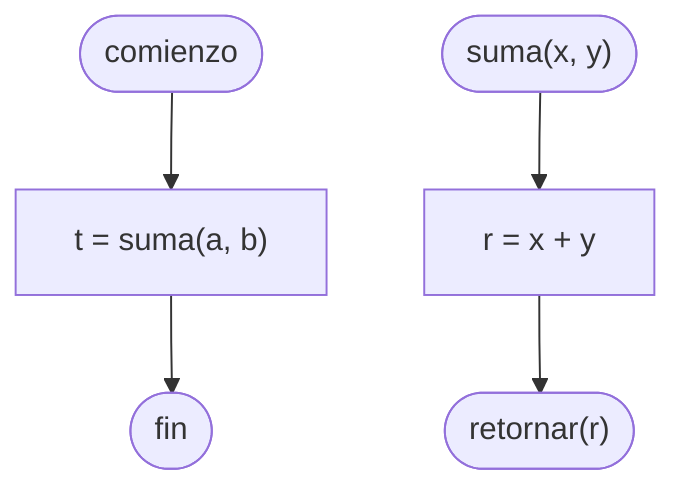
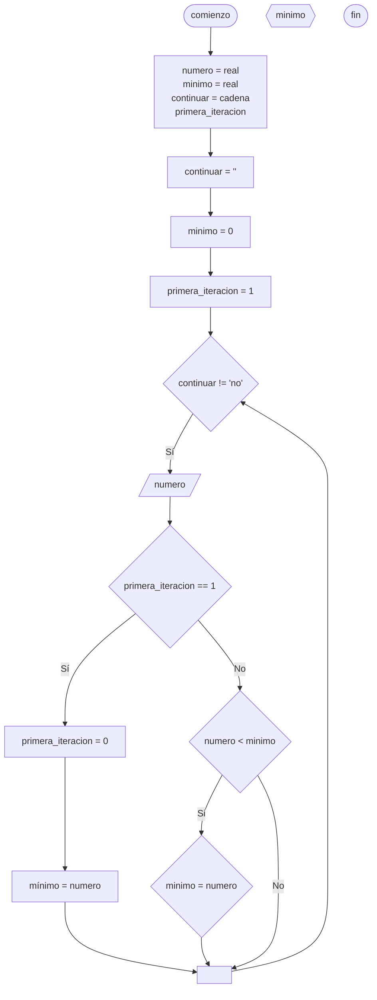
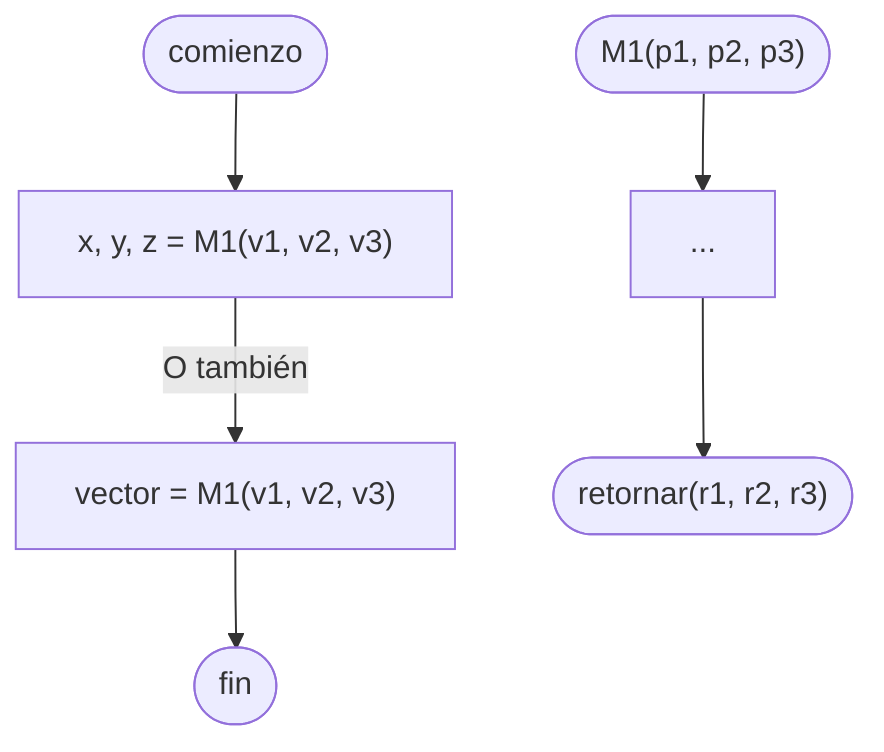

# Algoritmos y Estructuras de Datos

## Acumulador

Una [[Variables|variable]] que utilizamos para llevar la cuenta de, por ejemplo, la sumatoria de una serie, generalmente en una [[Estructura de repetición]].

```python
acu = acu + valor
```

> [!note]
> En [[Python]], también podemos realizar esta asignación de una forma abreviada.
>
> ```python
> acu += valor
> ```

Conceptualmente, podemos verlo de la siguiente forma.

```
acumulador = acumulador + valor_a_sumar
```

## Algoritmos

Es un conjunto **preciso** (orden), **definido** (si se ejecuta múltiples veces debemos llegar a la solución) y finito de operaciones simples a través del cual podemos hallar la solución a un problema.

> [!note]
> Podemos crear dos algoritmos con el mismo [[Objetivo]], pero que difieran en su rapidez o eficiencia, y aún así llegar al mismo [[Salidas|Resultado]].

Para diseñar un algoritmo, podemos utilizar [[Pseudocódigo]] y/o un [[Diagrama de flujo]].

Cuando terminamos de diseñar nuestro algoritmo, generalmente queremos escribir un [[Programa propio]] para implementarlo en [[Sistemas]], mediante un [[Lenguaje de programación]].

### Diagrama de flujo



### Python

```python
nombre_vector = [valor_inicial] * elementos

## ejemplo
elementos = 3
vector_r3 = [0.0] * elementos ## [0.0, 0.0, 0.0]
```

## Bandera

Se utiliza para saber si la ejecución de un [[Programa propio]] pasó por un cierto punto del código o no. Es decir, es una [[Variables|variable]] que puede ser verdadera o falsa.

Por ejemplo, podemos utilizarla para saber si una de las ramas de una [[Bifurcaciones|bifurcación]] fue ejecutada o no.



## Biblioteca

Las **bibliotecas** (también conocidas como **módulos**) son conjuntos de [[Algoritmos y Estructuras de Datos/Función|Función]], clases y métodos predefinidos que ==amplían la funcionalidad básica== del [[Lenguaje de programación]].

> [!tip]
> Las bibliotecas se pueden instalar desde el repositorio oficial de [[Python]] (PyPI) utilizando la herramienta `pip`.

## Bifurcaciones

Es una condición en nuestro programa. Dependiendo del ==valor de verdad== de la condición evaluada, el código ejecutado será uno u otro. Está formada por 3 partes básicas:

1. [[Variables|Variable]]
2. Operador de relación u [[Operadores lógicos|operador lógico]]
3. Constante o [[Variables|Variable]]

Por ejemplo:

$$
x > 5
$$

Podemos ==conectar múltiples condiciones== utilizando [[Conectivos lógicos]]. Los más comunes son [[Compuerta AND|AND]], [[Compuerta OR|OR]] y [[Compuerta NOT|NOT]].

### Bifurcación simple

Es aquella en la que ==solo uno de los caminos== posibles tiene instrucciones para ejecutar. Por ejemplo, un bloque `if` que solo ejecute instrucciones adicionales si la condición es verdadera.

### Bifurcación doble

Es aquella en la que, ==tanto para una condición verdadera como una falsa==, se ejecutarán instrucciones adicionales correspondientes a cada camino.

## Cadena

Una cadena es una [[Lista]] de carácteres.

Podemos obtener el carácter $n \in \mathbb{Z}$ de una cadena `abc` de la siguiente forma. Si $n$ es negativo, comienza a contar desde el lado derecho de la cadena.

```python
abc[n]
```

> [! important]
> El índice de los elementos de una cadena comienza en $0$.

También podemos tomar una parte de la cadena, desde el índice $n$ hasta $m$, con un paso o _step_ de $t$. Este intervalo es de la forma $[n, m)$.

```python
abc[n:m:t]
```

Si $n$ no está especificado, es $0$, si $m$ no está especificado, toma el último carácter de la cadena, y si $t$ no está especificado, es $1$.

## Ciclo desde-hasta

Es una [[Estructura de repetición]] que ejecuta una serie de instrucciones dadas un ==número fijo de veces==.

Para esto, utilizamos una [[Variables|Variable]] de control, y le especificamos cuál debe ser su valor inicial y final.

### Diagrama de flujo



### Python

```python
## Este ciclo se ejecutará 10 veces
for i in range(0, 10): ## El intervalo es de la forma [0, 10)
    print(f"El ciclo se ejecutó {i} veces")
```

## Ciclo mientras

Es una [[Estructura de repetición]] que ejecuta una serie de instrucciones dadas **mientras** se cumpla una condición.

Para evitar que se vuelva un ciclo infinito, podemos utilizar diferentes estrategias:

- Utilizar un [[Contador]]
- Controlar con una opción a continuar
- Controlar con [[Valor centinela]]
- Controlar con una [[Bandera]]

### Pseudocódigo

```
c = 0

mientras c < 4 entonces
    c = c + 1
    mostrar("El ciclo se ejecutó {c} veces")
fin_mientras
```

### Diagrama de flujo



### Python

```python
c = 0

while c < 4:
    c = c + 1
    print(f"El ciclo se ejecutó {c} veces")
```

## Ciclo repetir-hasta

Es una [[Estructura de repetición]] que ejecuta una serie de instrucciones dadas, y solo continúa ejecutándose **mientras** se cumpla una condición, que solo se evalúa luego de la primera iteración del bucle. También conocida como `repeat` o `do while`.

[[Python]] no tiene una estructura nativa para el ciclo repetir-hasta.

### Pseudocódigo

```
c = 0

repetir
    c = c + 1
    mostrar("El ciclo se ejecutó {c} veces")
hasta c < 4
```

### Diagrama de flujo



## Compilador

Es un programa especial que traduce código escrito en un [[Lenguaje de programación]] a [[Lenguaje de máquina]].

El código compilado suele ser **más rápido, eficiente y compacto** que el código ejecutado por un [[Interpretador]]. Sin embargo, solo funciona en la arquitectura de la [[CPU]] para la que se generó, y es un tanto inconveniente ya que es necesario recompilar cada vez que se quiera ejecutar el programa luego de hacer un cambio.

## Contador

Una [[Variables|variable]] que utilizamos para llevar la cuenta de, por ejemplo, la cantidad de veces que se ha ejecutado cierto bloque de código, generalmente una [[Estructura de repetición]].

```python
x = x + 1
```

> [!note]
> En [[Python]], también podemos realizar esta asignación de una forma abreviada.
>
> ```python
> x += 1
> ```

Conceptualmente, podemos verlo de la siguiente forma.

```
variable_numerica = variable_numerica + 1
```

## Diagrama de flujo

Es una manera de **representar gráficamente** un algoritmo o un proceso de alguna naturaleza, a través de una serie de pasos estructurados y vinculados que permiten su revisión como un todo.

Se realiza utilizando una convención de **símbolos**, por lo que, a diferencia del [[Pseudocódigo]], es **universal**, y no es necesario que el emisor y el receptor hablen el mismo idioma para poder entenderlo.

![[terminator-symbol.png]]

![[action-symbol.png]]

![[manual-input-symbol.png]]

![[decision-symbol.png]]

![[display-symbol.png]]

## Diseño descendente

Luego de descomponer mi problema en módulos mediante la [[Programación modular]], comenzamos a diseñar el nivel $n$ de un módulo $x$. Luego, refinaremos al mismo en un nivel $n + 1$, luego nivel $n + 2$, y así sucesivamente hasta llegar a [[Algoritmos]] completos que podemos codificar en el [[Lenguaje de programación]] deseado.

## Efecto lateral

Cuando la ejecución de una [[Algoritmos y Estructuras de Datos/Función|Función]] ==modifica [[Variables]] globales== de un programa, decimos que genera un **efecto lateral**.

## Error de ejecución

Cuando le damos al programa un cálculo absurdo que no puede realizar. Por ejemplo, raíces pares de números negativos, logaritmos de números negativos, división por 0, etc.

## Error de sintaxis o compilación

Cuando codifico mal una acción.

## Error lógico

El programa funciona perfectamente, pero las operaciones que le pedimos que resuelva están mal formuladas, ya sea por un error de concepto, de tipeo, etc.

## Errores

Un error puede causar problemas en nuestro programa, o hasta incluso terminar su ejecución. Este puede ser un [[Error de sintaxis o compilación]], un [[Error de ejecución]], o un [[Error lógico]].

## Estructura de casos

Un tipo de [[Estructura de selección]] que compara una [[Variables|Variable]] con una serie de _casos_, y ejecuta las instrucciones correspondientes dependiendo del valor de la misma.

Se puede representar con [[Pseudocódigo]] o [[Diagrama de flujo]]. [[Python]] implementó está estructura en la versión 3.10, pero también se puede hacer algo similar utilizando [[Bifurcaciones]] anidadas con `elif`.

### Diagrama de flujo



### Pseudocódigo

![[Pseudocódigo#^estructura-de-casos]]

### Python

En [[Python]] tenemos la posibilidad de especificar múltiples posibles valores dentro de un mismo caso, utilizando `|`.

```python
x = 3

match x:
    case 1:
        print("El número es 1")
    case 2 | 3:
        print("El número es 2 o 3")
    case _:
        print("El número no es ni 1, ni 2, ni 3")
```

## Estructura de repetición

Las instrucciones que especifiquemos se ejecutan múltiples veces, según las condiciones que le demos al bucle o _loop_.

Por ejemplo: [[Ciclo desde-hasta]] (`for`), [[Ciclo mientras]] (`while`), [[Ciclo repetir-hasta]] (`repeat`/`do while`).

## Estructura de selección

Se evalúa una condición por verdadero o falso, y se ejecutan las instrucciones correspondientes.

Por ejemplo: [[Bifurcaciones]] (`if`) o [[Estructura de casos]] (`match`/`switch`).

## Estructura secuencial

Se ejecuta una instrucción después de la otra, el 100% de las veces.

## Estructuras de control

Todo [[Programa propio]] se puede construir utilizando 3 estructuras:

- [[Estructura secuencial]]
- [[Estructura de selección]]
- [[Estructura de repetición]]

## Estructuras de datos

Existen diferentes tipos, entre ellas:

- [[Variables]]
- Vectores, [[Matriz|matrices]] o listas
- [[Conjunto|Conjuntos]]
- Archivos
- Pilas
- Colas

## Función CHR

En [[Python]], la [[Algoritmos y Estructuras de Datos/Función|Función]] `chr` nos permite obtener el carácter asociado a un código ASCII.

```python
chr(97) ## 'a'
```

## Función ORD

En [[Python]], la [[Algoritmos y Estructuras de Datos/Función|Función]] `ord` nos permite obtener el código ASCII asociado a un carácter.

```python
ord("a") ## 97
```

## Función split

En [[Python]], la [[Algoritmos y Estructuras de Datos/Función|Función]] `split` nos permite crear un [[Vector]] a partir de una [[Variables|Variable]] de tipo **cadena**, especificando el **separador** utilizado.

```python
vector = variable.split(separador)
```

Por ejemplo, con un [[Vector]] de apellidos.

```python
apellidos = "Stanicio;Perez;Rey"
vector = apellidos.split(";") ## ["Stanicio", "Perez", "Rey"]
```

## Función

Un bloque de código que puede recibir [[Parámetros]] de [[Entradas|Entrada]], ejecuta las instrucciones dadas, y ==devuelve un único valor== de [[Salidas|Salida]].

### Python

En [[Python]], las funciones se declaran de la siguiente forma.

```python
def suma(x, y):
    r = x + y

    return r

t = suma(a, b)
```

> [!tip]
> Para indicar la [[Salidas|Salida]] de un [[Algoritmos y Estructuras de Datos/Función|Función]] en [[Python]], utilizamos la palabra `return`.

### Diagrama de flujo

En un [[Diagrama de flujo]], las funciones se declaran de la siguiente forma.



## Funciones trigonométricas

Para utilizar [[Algoritmos y Estructuras de Datos/Función|funciones]] trigonométricas en [[Python]], debemos ==importar== la [[Biblioteca]] `math`.

> [!warning]
> Las funciones trigonométricas en [[Python]] trabajan con **radianes**.

```python
import math

x = math.sin(2 * math.pi) ## seno
y = math.cos(math.pi) ## coseno
z = math.tan(3 * math.pi / 4) ## tangente
```

### Grados y radianes

Para realizar la ==conversión== de grados a radianes, o viceversa, podemos utilizar las funciones `math.radians` y `math.degrees` respectivamente.

```python
import math

a = math.radians(180) ## pi
b = math.degrees(2 * math.pi) ## 360°
```

### Funciones adicionales

```python
import math

x = 1 / math.cos(2 * math.pi) ## secante
y = 1 / math.sin(math.pi) ## cosecante
z = 1 / math.tan(3 * math.pi / 4) ## cotangente

a = math.asin(2 * math.pi) ## arcoseno
b = math.acos(math.pi) ## arcocoseno
c = math.atan(3 * math.pi / 4) ## arcotangente
```

## Interpretador

Un interpretador ejecuta código fuente línea por línea, **sin compilación previa**. Es decir, lee, analiza y traduce el código a instrucciones que la [[CPU]] ejecuta. Por lo tanto, es **multiplataforma**.

Esto hace que sea más fácil de utilizar, ya que no es necesario compilar el código para ejecutarlo. Aún así, suele ser más lento y menos eficiente que un [[Compilador]].

## Lenguaje de alto nivel

Utiliza lenguaje humano en su sintaxis, es mucho más simple que un [[Lenguaje de bajo nivel o ensamblador]], lo cual tiene sus ventajas.

- Ofrecen una capa de **abstracción**, ocultando las complejidades del hardware de la computadora.
- Debido a que su sintaxis se asemeja al lenguaje natural, son más **fáciles de aprender, leer y escribir**.
- La facilidad de uso proporcionada **permiten centrarse en la lógica** y la funcionalidad del programa en lugar de los detalles del hardware subyacente.

Algunos ejemplos de estos lenguajes son [[Python]], Java, C++, JavaScript y PHP

## Lenguaje de bajo nivel o ensamblador

Están más cerca del [[Lenguaje de máquina]], por lo que ofrecen un ==control detallado== sobre los [[Recursos]] de hardware como la [[RAM|memoria]] y los registros. Debido a esto, suelen tener un **mayor rendimiento**, siendo una mejor opción cuando se busca maximizar la velocidad y eficiencia del software.

Sin embargo, esto también los hace ==más complejos==, requieren un profundo **conocimiento de la arquitectura informática**, y los hace difíciles de aprender y mantener.

Un ejemplo de este lenguaje es **Assembly**.

## Lenguaje de máquina

Es el sistema de códigos que la [[CPU]] de una computadora puede entender y ejecutar. Se compone de una serie de instrucciones binarias, es decir, utilizan el [[Conjunto binario]], que indican a la [[CPU]] qué operaciones realizar.

> [!warning]
> Es específico para cada tipo de [[CPU]], por lo que un programa de este tipo no será compatible con una arquitectura diferente.

Sin embargo, estos programas son generalmente los más ==rápidos y eficientes==, ya que no hay necesidad de un [[Compilador]] o [[Interpretador]].

## Lenguaje de programación

Es un sistema formal que **permite dar instrucciones** a un computador, el cual puede ser un [[Lenguaje de bajo nivel o ensamblador]] o un [[Lenguaje de alto nivel]].

El código fuente es traducido a [[Lenguaje de máquina]] que el computador puede ejecutar, mediante un [[Compilador]] o [[Interpretador]].

## Longitud lógica

El largo del contenido de elemento o [[Variables|Variable]], generalmente un [[Vector]] o cadena de caracteres.

### Pseudocódigo

En [[Pseudocódigo]], el largo se obtiene de la siguiente forma.

```
declarar x = entero, a = cadena

x = largo(a)
```

### Python

En [[Python]], el largo se obtiene de la siguiente forma.

```python
x = len(a)
```

## Mínimo

El [[Algoritmos|algoritmo]] para encontrar el mínimo de una lista de números.

### Diagrama de flujo



## Números aleatorios

Para generar **números aleatorios** en [[Python]], debemos ==importar== la [[Biblioteca]] `random`.

```python
import random
```

### Números reales

Para generar números reales, utilizamos la [[Algoritmos y Estructuras de Datos/Función|Función]] `random`.

Si no utilizamos ningún parámetro, obtendremos un valor entre $0$ (cerrado) y $1$ (abierto), es decir $[0, 1)$.

```python
import random

x = random.random() ## [0, 1)
```

Si pasamos parámetros, podemos especificar el intervalo del cual queremos obtener un número aleatorio:

1. Valor mínimo (cerrado, incluido en el intervalo)
2. Valor máximo (abierto, **no** incluido en el intervalo)

```python
import random

y = random.random(-5, 10) ## [-5, 10)
```

### Números enteros

Para generar números enteros, utilizamos la [[Algoritmos y Estructuras de Datos/Función|Función]] `randint`.

Esta función requiere dos parámetros, que nos permiten especificar el ==intervalo cerrado== del cual queremos obtener un número aleatorio:

1. Valor mínimo
2. Valor máximo

```python
import random

z = random.randint(10, 100) ## [10, 100]
```

## Operador ternario

Una forma más breve de escribir una [[Bifurcaciones|bifurcación]].

En [[Python]] se escribe de la siguiente forma:

```python
print("Par" if x % 2 == 0 else "Impar")
```

## Operadores lógicos

Estos son los operadores que podemos utilizar en un [[Python]] para comparar dos valores numéricos.

- Mayor: `>`
- Mayor o igual: `>=`
- Menor: `<`
- Menor o igual: `<=`
- Igual: `==`
- Distinto: `!=`

## Parámetros

Son el medio de comunicación entre el [[Programa propio]] y una [[Algoritmos y Estructuras de Datos/Función|Función]], y viceversa.

### Parámetros formales

Son los parámetros definidos en la misma definición de la [[Algoritmos y Estructuras de Datos/Función|Función]], y actúan como [[Variables#Variables locales]] de la misma.

### Parámetros actuales

Son los valores de los parámetros pasados para una ==ejecución específica== de una [[Algoritmos y Estructuras de Datos/Función|Función]]. Suelen ser [[Variables]].

### Parámetros opcionales

Si un [[Parámetros|Parámetro]] es optional, la ejecución de la [[Algoritmos y Estructuras de Datos/Función|Función]] puede realizarse sin necesitad de darle un valor.

> [!important]
> Aunque sea opcional pasar el [[Parámetros|Parámetro]], esto no quiere decir que no existe, sino que **automaticamente** se le asigna un **valor por defecto**.

En [[Python]] podemos hacerlo de la siguiente forma, donde `pfo` es un [[Parámetros|Parámetro]] opcional.

```python
def func(pf: int, pfo: int = 0):
    ...
```

## Procedimiento

Un [[Conjunto]] de sentencias que recibe **parámetros** de [[Entradas|Entrada]], ejecuta las instrucciones dadas, y, a diferencia de una [[Análisis Matemático I/Función|Función]], puede tener una ==única [[Salidas|Salida]], múltiples, o ninguna==.

> [!tip]
> La [[Salidas|Salida]] de un [[Procedimiento]] puede guardarse en [[Variables]] individuales, o en un [[Vector]].

### Python

En [[Python]], los procedimientos se declaran y se utilizan de la siguente forma.

```python
def procedimiento(p1, p2, p3)
    ...
    return r1, r2, r3

x, y, z = procedimiento(v1, v2, v3)
## o también
vector = procedimiento(v1, v2, v3)
```

### Diagrama de flujo

En un [[Diagrama de flujo]], los procedimientos se declaran y se utilizan de la siguente forma.



## Programa propio

Es un programa que tiene un principio y un final. No varios finales posibles, por ejemplo. Para construirlo utilizamos [[Estructuras de control]].

Además, puede presentar [[Errores]] de diferentes tipos.

## Programación modular

Al momento de diseñar un [[Algoritmos]], podemos dividir al problema en [[Biblioteca|módulos]] y **submódulos**, que nos permiten simplificar las tareas que hay que realizar.

Luego, cada módulo puede ser implementado mediante [[Algoritmos y Estructuras de Datos/Función]] y procedimientos.

## Pseudocódigo

El pseudocódigo es una **manera sencilla de expresar** los pasos que debe realizar un programa hasta alcanzar su objetivo, utilizando el [[Lenguaje natural]].

### Declaración de [[Variables]]

Para declarar variables y sus tipos.

```
declarar variable1 = tipo, variable2 = tipo ...
```

### Inicialización de [[Variables]]

Para asignarle un valor a una variable.

```
variable = valor
```

### Mostrar el valor de [[Variables]]

```
mostrar(variable)
```

### Input del usuario

Para guardar en una variable la entrada del usuario.

```
leer(variable1)
```

### [[Bifurcaciones#Bifurcación simple|Bifurcación simple]]

```
si condición entonces
  instruccion
fin-si
```

### [[Bifurcaciones#Bifurcación doble|Bifurcación doble]]

```
si condición entonces
  instruccion1
sino
  instruccion2
fin-si
```

### [[Estructura de casos]]

```
comienzo

segun_sea variable hacer
    constanteA:
        A1
        A2
    constanteB:
        B1
        B2
    constanteC:
        C1
        C2
fin_segun_sea

fin
```

^estructura-de-casos

## Python

Es un [[Lenguaje de alto nivel]], interpretado, orientado a objetos y de propósito general.

## Sentencia fantasma

Una [[Bifurcaciones|bifurcación]] donde el bloque de código que se debe ejecutar si la condición se cumple está vacío.

En [[Python]] esto generará un [[Errores|error]] de tipo `IndentError`, para evitar esto podemos utilizar `next`:

```python
if x > 1:
    next
else:
    print("abc")
```

## Valor centinela

Una [[Variables|variable]] ingresada por el usuario, que al recibir un ==valor absurdo==, indica que un proceso (generalmente un [[Estructura de repetición|Ciclo]]) debe detenerse, y la [[Información]] ingresada en esta última iteración y ==no debe procesarse==.

## Variables

Son objetos que se encuentran en la memoria [[RAM]] del dispositivo.

Las variables deben ser ==declararadas==. Para esto debemos darle un nombre, e indicar qué ==tipo de dato== va a contener.

### Variables locales

Llamamos ==variables locales== a aquellas variables que son declaradas y utilizadas dentro de una [[Algoritmos y Estructuras de Datos/Función|Función]], y no son accesibles fuera de la misma.

> [!important]
> Las [[Variables]] **globales** son aquellas declaradas en el nivel base de un [[Programa propio]], y son accesibles en cualquier lugar del mismo.

## Vector

Un ==[[Conjunto]] de elementos==, dentro de los cuales podemos almacenar un [[Dato]].

> [!tip]
> En [[Python]] los elementos de un [[Vector]] pueden ser de ==cualquier tipo de dato==, pero esto no es posible en cualquier [[Lenguaje de programación]]

En [[Python]], podemos hacerlo de la siguiente forma.

```python
vector = [2, "abc", True, 0.5]
```

Para trabajar con un elemento de un [[Vector]], debemos seleccionarlo por su ==índice==.

> [!warning]
> El índice de los elementos de un [[Vector]] suele comenzar en $0$, no en $1$.

En [[Python]], podemos hacerlo de la siguiente forma.

```python
vector = [3, 5]
vector[0] += 4

print(vector[0]) ## 7
print(vector[1]) ## 5
```

### Vector multidimensional

Un [[Vector]] ==multidimensional==, es un [[Vector]] cuyos ==elementos son [[Vector|Vectores]] o [[Vector|Vectores]]==. Por lo tanto, también podemos considerarlas [[Matriz|Matrices]]. Por ejemplo, en [[Python]], una [[Matriz]] bidimensional de $3 \times 3$:

```python
matriz = [[1, 2, 3],
		  [4, 5, 6],
		  [7, 8, 9]]
```

O una [[Matriz]] tridimensional de $2 \times 2 \times 2$:

```python
matriz = [[[1, 2], [3, 4]],
		  [[5, 6], [7, 8]]]
```

## Vector acumulador

Un [[Vector]] donde cada elemento es un [[Acumulador]] para alguna serie de [[Dato|Datos]] particular.

> [!tip]
> Un [[Vector acumulador]] sirve para reemplazar una [[Estructura de casos]] de [[Acumulador|Acumuladores]].
>
> ```mermaid
> flowchart TB
>     comienzo([comienzo])
>
>     condicion{variable}
>
>     e1["a1 += valor"]
>     e2["a2 += valor"]
>     ei["..."]
>     en["an += valor"]
>
>     a[" "]
>
>     fin([fin])
>
>     comienzo --> condicion
>     condicion -- 1 --> e1
>     condicion -- 2 --> e2
>     condicion -- "..." --> ei
>     condicion -- n --> en
>     e1 & e2 & ei & en --> a --> fin
> ```

```python
acumuladores[i] = acumuladores[i] + x
```

## Vector contador

Un [[Vector]] donde cada elemento es un [[Contador]] para alguna serie de [[Dato|Datos]] particular.

> [!tip]
> Un [[Vector contador]] sirve para reemplazar una [[Estructura de casos]] de [[Contador|Contadores]].
>
> ```mermaid
> flowchart TB
>     comienzo([comienzo])
>
>     condicion{variable}
>
>     e1["c1 += 1"]
>     e2["c2 += 1"]
>     ei["..."]
>     en["cn += 1"]
>
>     a[" "]
>
>     fin([fin])
>
>     comienzo --> condicion
>     condicion -- 1 --> e1
>     condicion -- 2 --> e2
>     condicion -- "..." --> ei
>     condicion -- n --> en
>     e1 & e2 & ei & en --> a --> fin
> ```

```python
contadores[i] = contadores[i] + 1
```

## Vectores paralelos

Cuando la **posición** de los elementos de dos o más [[Vector|Vectores]] mantienen una **relación**, decimos que estamos trabajando con un [[Sistemas|Sistema]] de [[Vectores paralelos]].

> [!important]
> Todos los [[Vector|Vectores]] deben tener la **misma cantidad** de elementos.

Por ejemplo, podemos tener [[Vectores paralelos]] para guardar la información personal de los usuarios.

```python
apellido = ["Stanicio", "Perez", "Rey"]
edad = [18, 32, 21]
altura = [1.72, 1.65, 1.68]
```
