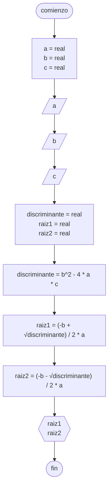

# 20240405 - Cuadrática

Se ingresan los términos A,B, y C de la función cuadrática. Hallar las raices y mostrarlas por pantalla.

## Pseudocódigo

```
comienzo

declarar a = real, b = real, c = real

leer(a)
leer(b)
leer(c)

declarar discriminante = real, raiz1 = real, raiz2 = real

discriminante = b^2 - 4 * a * c

raiz1 = (-b + √discriminante) / 2 * a
raiz2 = (-b - √discriminante) / 2 * a

mostrar(raiz1)
mostrar(raiz2)

fin
```

## Diagrama de flujo


