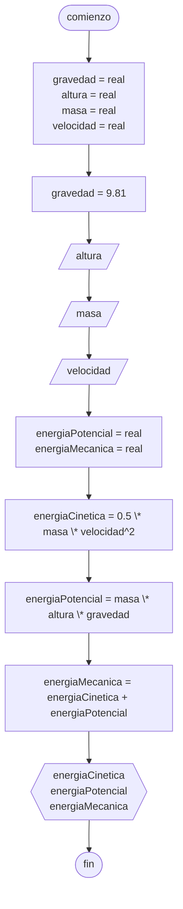

# 20240405 - Energía
Se ingresa altura, masa y velocidad de un objeto. Calcular la energia cinética, potencial y mecánica, y mostrarlas en pantalla.

## Pseudocódigo
```
comienzo

declarar gravedad = real, altura = real, masa = real, velocidad = real

gravedad = 9.81

leer(altura)
leer(masa)
leer(velocidad)

declarar energiaCinetica = real, energiaPotencial = real, energiaMecanica = real

energiaCinetica = 0.5 * masa * velocidad^2
energiaPotencial = masa * altura * gravedad

energiaMecanica = energiaCinetica + energiaPotencial

mostrar("Energía cinética: ", energiaCinetica)
mostrar("Energía potencial: ", energiaPotencial)
mostrar("Energía mecánica: ", energiaMecanica)

fin
```

## Diagrama de flujo
