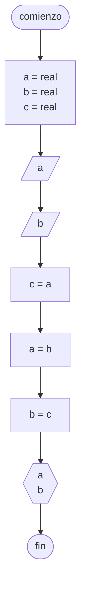

# 20240405 - Intercambio de variables

Se ingresan dos números reales en las variables `a` y `b` respectivamente. Realizar un algoritmo para intercambiar los contenidos y mostrarlos por pantalla.

## Pseudocódigo

```
comienzo

declarar a = real, b = real, c = real

leer(a)
leer(b)

c = a
a = b
b = c

mostrar(a)
mostrar(b)

fin
```

## Diagrama de flujo


