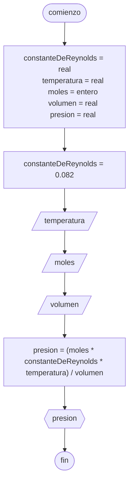

# 20240405 - Presión

Se ingresa temperatura, moles y volumen. Calcular la presión y mostrarla por pantalla.

## Pseudocódigo

```
comienzo

declarar constanteDeReynolds = real, temperatura = real, moles = entero, volumen = real, presion = real

constanteDeReynolds = 0.082

leer(temperatura)
leer(moles)
leer(volumen)

presion = (moles * constanteDeReynolds * temperatura) / volumen

mostrar(presion)

fin
```

## Diagrama de flujo


