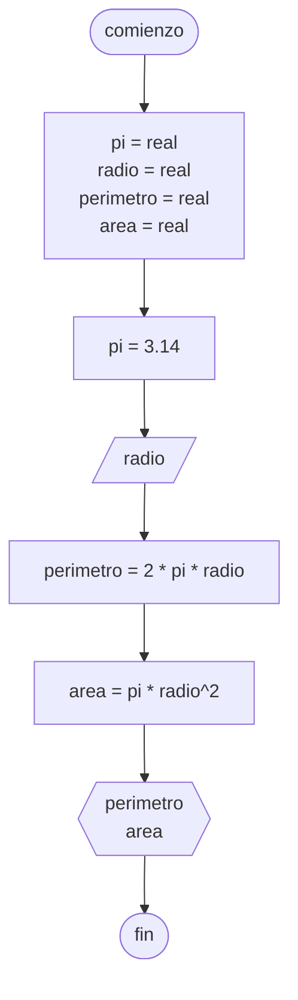

# 20240409 - Circunferencia

Se ingresa el radio de una circunferencia. Calcular el área y perímetro.

## Pseudocódigo

```
comienzo

declarar pi = real, radio = real, perimetro = real, area = real

pi = 3.14

leer(radio)

perimetro = 2 * pi * radio
area = pi * radio^2

mostrar(perimetro)
mostrar(area)

fin
```

## Diagrama de flujo


