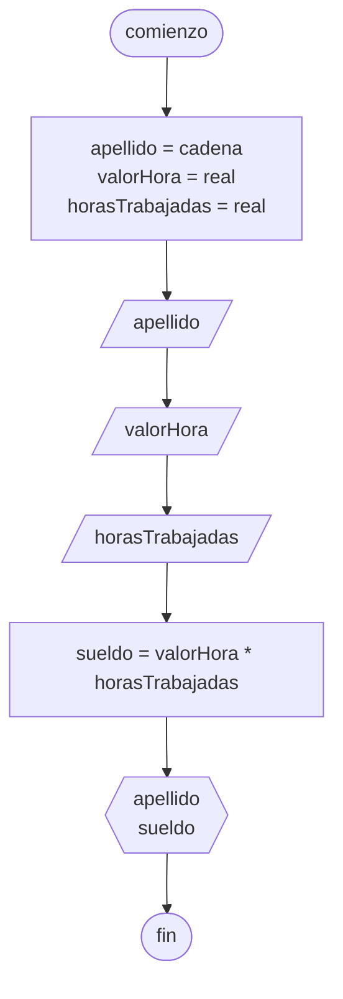

# 20240409 - Sueldo

Se ingresa el apellido, el valor hora, y la cantidad de horas trabajadas. Calcular el sueldo.

## Pseudocódigo

```
comienzo

declarar apellido = cadena, valorHora = real, horasTrabajadas = real

leer(apellido)
leer(valorHora)
leer(horasTrabajadas)

sueldo = valorHora * horasTrabajadas

mostrar(apellido)
mostrar(sueldo)

fin
```

## Diagrama de flujo


