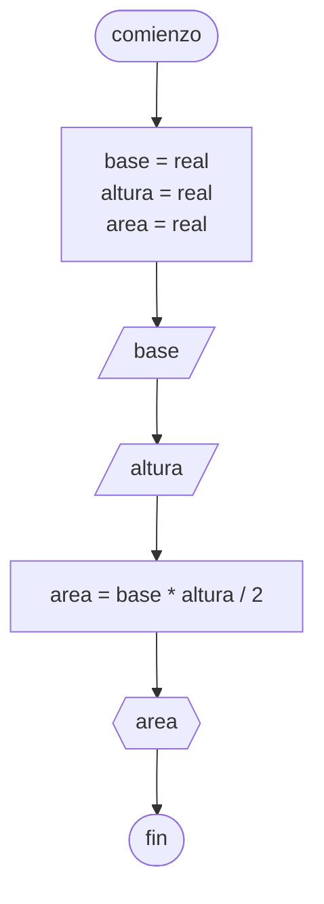

# 20240409 - Triángulo
Se ingresa la base y la altura de un triángulo. Calcular superficie.
## Pseudocódigo
```
comienzo

declarar base = real, altura = real, area = real

leer(base)
leer(altura)

area = base * altura / 2

mostrar(area)

fin
```

## Diagrama de flujo
