# 20240416 - Palindromo

Se ingresa un número entero de 4 dígitos, mostrar el número inverso.

## Pseudocódigo

```
comienzo

declarar numero_ingresado = entero, numero_ingresado_milesima = entero, numero_ingresado_centena = entero, numero_ingresado_decena = entero, numero_ingresado_unidad = entero, palindromo_milesima = entero, palindromo_centena = entero, palindromo_decena = entero, palindromo_unidad = entero, palindromo = entero

leer(numero_ingresado)

numero_ingresado_milesima = numero_ingresado // 1000
numero_ingresado_centesima = numero_ingresado % 1000 // 100
numero_ingresado_decena = numero_ingresado % 100 // 10
numero_ingresado_unidad = numero_ingresado % 10

palindromo_milesima = numero_ingresado_milesima * 1000
palindromo_centena = numero_ingresado_centena * 100
palindromo_decena = numero_ingresado_decena * 10
palindromo_unidad = numero_ingresado_unidad

palindromo = palindromo_milesima + palindromo_centena + palindromo_decena + palindromo_unidad

mostrar(palindromo)

fin
```

## Diagrama de flujo

```mermaid
flowchart TB
	comienzo([comienzo])

	variables1["`numero_ingresado = entero
	numero_ingresado_milesima = entero
	numero_ingresado_centena = entero
	numero_ingresado_decena = entero
	numero_ingresado_unidad = entero`"]
	variables2["`palindromo_milesima = entero
	palindromo_centena = entero
	palindromo_decena = entero
	palindromo_unidad = entero
	palindromo = entero`"]

	leer_numero_ingresado[/numero_ingresado/]

	numero_ingresado_milesima["numero_ingresado_milesima = numero_ingresado // 1000"]
	numero_ingresado_centesima["numero_ingresado_centesima = numero_ingresado % 1000 // 100"]
	numero_ingresado_decena["numero_ingresado_decena = numero_ingresado % 100 // 10"]
	numero_ingresado_unidad["numero_ingresado_unidad = numero_ingresado % 10"]

	palindromo_milesima["palindromo_milesima = numero_ingresado_milesima * 1000"]
	palindromo_centena["palindromo_centena = numero_ingresado_centena * 100"]
	palindromo_decena["palindromo_decena = numero_ingresado_decena * 10"]
	palindromo_unidad["palindromo_unidad = numero_ingresado_unidad"]

	palindromo["palindromo = palindromo_milesima + palindromo_centena + palindromo_decena + palindromo_unidad"]

	mostrar{{"palindromo"}}
	
	fin([fin])

	comienzo --> variables1 --> variables2 --> leer_numero_ingresado --> numero_ingresado_milesima --> numero_ingresado_centesima --> numero_ingresado_decena --> numero_ingresado_unidad --> palindromo_milesima --> palindromo_centena --> palindromo_decena --> palindromo_unidad --> palindromo --> mostrar --> fin
```



## Código

```python
# AyED
# Autor: Martín Stanicio
# Fecha: 16/04/2024

numero_ingresado = 0
numero_ingresado_milesima = 0
numero_ingresado_centena = 0
numero_ingresado_decena = 0
numero_ingresado_unidad = 0

palindromo_milesima = 0
palindromo_centena = 0
palindromo_decena = 0
palindromo_unidad = 0
palindromo = 0

try:
    numero_ingresado = int(input("Ingrese un número de 4 dígitos: "))
except ValueError:
    print("\nPor favor ingrese números válidos")

numero_ingresado_milesima = numero_ingresado // 1000
numero_ingresado_centesima = numero_ingresado % 1000 // 100
numero_ingresado_decena = numero_ingresado % 100 // 10
numero_ingresado_unidad = numero_ingresado % 10

palindromo_milesima = numero_ingresado_milesima * 1000
palindromo_centena = numero_ingresado_centena * 100
palindromo_decena = numero_ingresado_decena * 10
palindromo_unidad = numero_ingresado_unidad
palindromo = (
    palindromo_milesima + palindromo_centena + palindromo_decena + palindromo_unidad
)

print(palindromo)
```
