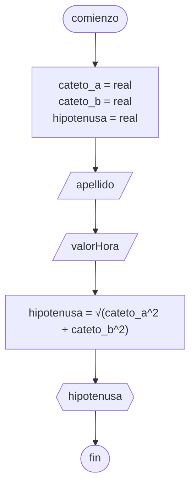

# 20240416 - Triángulo rectángulo

Se ingresan los catetos de un triángulo rectángulo, hallar la hipotenusa.

## Pseudocódigo

```
comienzo

declarar cateto_a = real, cateto_b = real, hipotenusa = entero

leer(cateto_a)
leer(cateto_b)

hipotenusa = √(cateto_a^2 + cateto_b^2)

mostrar(hipotenusa)

fin
```

## Diagrama de flujo


