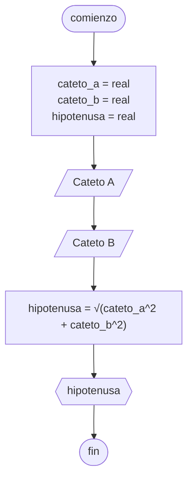

# 20240416 - Triángulo rectángulo

Se ingresan los catetos de un triángulo rectángulo, hallar la hipotenusa.

## Pseudocódigo

```
comienzo

declarar cateto_a = real, cateto_b = real, hipotenusa = entero

leer(cateto_a)
leer(cateto_b)

hipotenusa = √(cateto_a^2 + cateto_b^2)

mostrar(hipotenusa)

fin
```

## Diagrama de flujo



## Código

```python
# AyED
# Autor: Martín Stanicio
# Fecha: 16/04/2024

cateto_a = 0.0
cateto_b = 0.0
hipotenusa = 0.0

try:
    cateto_a = float(input("Ingrese al cateto A: "))
    cateto_b = float(input("Ingrese al cateto B: "))
except ValueError:
    print("\nPor favor ingrese números válidos")

hipotenusa = (cateto_a**2 + cateto_b**2) ** 0.5

print(hipotenusa)
```
