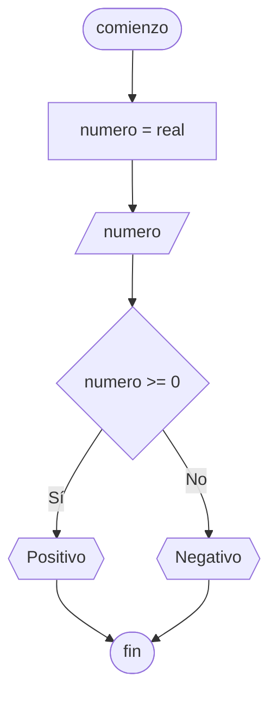

# 20240419 - Bifurcación doble

Se ingresa un número entero, mostrar "número positivo o número negativo" según corresponda. Se toma el 0 como positivo.

## Pseudocódigo

```
comienzo

declarar numero = real

leer(numero)

si numero >= 0 entonces
    mostrar("Positivo")
sino
    mostrar("Negativo")

fin
```

## Diagrama de flujo



## Código

```python
# AyED
# Autor: Martín Stanicio
# Fecha: 19/04/2024

numero = 0.0

try:
    numero = int(input("Ingrese un número: "))
except ValueError:
    print("\nPor favor ingrese un número válido")

if numero >= 0:
    print("Positivo")
else:
    print("Negativo")
```
