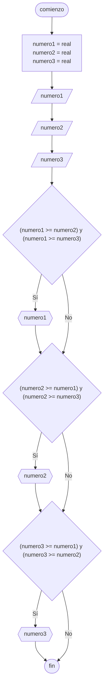

# 20240426 - Conectivos lógicos

Se ingresan 3 números, obtener el mayor utilizando [[Conectivos lógicos]].

## Pseudocódigo

```
comienzo

declarar numero1 = real, numero2 = real, numero3 = real

leer(numero1)
leer(numero2)
leer(numero3)

si (numero1 >= numero2) y (numero1 >= numero3) entonces
    print(numero1)
fin si

si (numero2 >= numero1) y (numero2 >= numero3) entonces
    print(numero2)
fin si

si (numero3 >= numero1) y (numero3 >= numero2) entonces
    print(numero3)
fin si

fin
```

## Diagrama de flujo



## Código

```python
# AyED
# Autor: Martín Stanicio
# Fecha: 26/04/2024

numero1 = 0.0
numero2 = 0.0
numero3 = 0.0

try:
    numero1 = float(input("Ingrese el número 1: "))
    numero2 = float(input("Ingrese el número 2: "))
    numero3 = float(input("Ingrese el número 3: "))
except ValueError:
    print("\nPor favor ingrese números válidos")

if numero1 >= numero2 and numero1 >= numero3:
  print(numero1)

if numero2 >= numero1 and numero2 >= numero3:
  print(numero2)
  
if numero3 >= numero1 and numero3 >= numero2:
  print(numero3)
```
