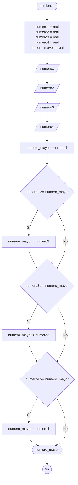

# 20240426 - Número mayor

Se ingresan 4 números, obtener el mayor. Solo utilizar [[Bifurcaciones#Bifurcación simple|bifurcaciones simples]] o [[Bifurcaciones#Bifurcación doble|dobles]].

## Pseudocódigo

```
comienzo

declarar numero1 = real, numero2 = real, numero3 = real, numero4 = real, numero_mayor = real

leer(numero1)
leer(numero2)
leer(numero3)
leer(numero4)

numero_mayor = numero1

si numero2 >= numero_mayor entonces
    numero_mayor = numero2
fin si

si numero3 >= numero_mayor entonces
    numero_mayor = numero3
fin si

si numero4 >= numero_mayor entonces
    numero_mayor = numero4
fin si

fin
```

## Diagrama de flujo



## Código

```python
# AyED
# Autor: Martín Stanicio
# Fecha: 26/04/2024

numero1 = 0.0
numero2 = 0.0
numero3 = 0.0
numero4 = 0.0
numero_mayor = 0.0

try:
    numero1 = float(input("Ingrese el número 1: "))
    numero2 = float(input("Ingrese el número 2: "))
    numero3 = float(input("Ingrese el número 3: "))
    numero4 = float(input("Ingrese el número 4: "))
except ValueError:
    print("\nPor favor ingrese números válidos")

numero_mayor = numero1

if numero2 >= numero_mayor:
  numero_mayor = numero2

if numero3 >= numero_mayor:
  numero_mayor = numero3

if numero4 >= numero_mayor:
  numero_mayor = numero4

print(numero_mayor)
```
