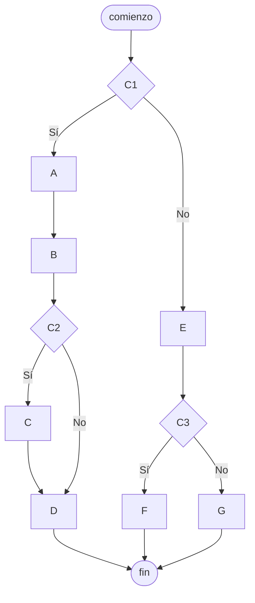

# 20240430 - Bifurcaciones anidadas 1

Replicar el diagrama de flujo en pseudocódigo.

## Diagrama de flujo



## Pseudocódigo

```
comienzo

si C1 entonces
    A
    B
    si C2 entonces
        C
    fin si
    D
sino
    E
    si C3 entonces
        F
    sino
        G
    fin si
fin si

fin
```
