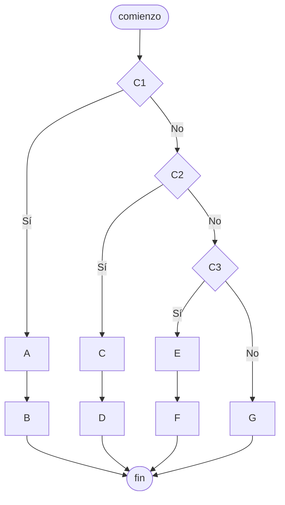

# 20240430 - Bifurcaciones anidadas 2

Replicar el diagrama de flujo en pseudocódigo.

## Diagrama de flujo



## Pseudocódigo

```
comienzo

si C1 entonces
    A
    B
sino
    si C2 entonces
        C
        D
    sino
        si C3 entonces
            E
            F
        sino
            G
        fin si
    fin si
fin si

fin
```
