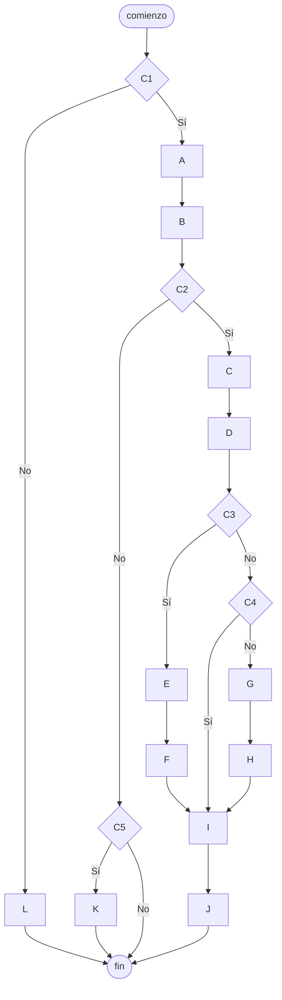

# 20240430 - Bifurcaciones anidadas 3

Replicar el pseudocódigo en un diagrama de flujo.

## Pseudocódigo

```
comienzo

si C1 entonces
    A
    B
    si C2 entonces
        C
        D
        si C3 entonces
            E
            F
        sino
            si C4 entonces
            sino
                G
                H
            fin si
        fin si
        I
        J
    sino
        si C5 entonces
            K
        fin si
    fin si
sino
    L
fin si

fin
```

## Diagrama de flujo


