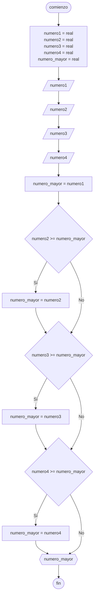

# 20240430 - Tipo de triángulo

Se ingresan los 3 lados de un triángulo, mostrar qué tipo de triángulo es según sus lados.

## Pseudocódigo

```
comienzo

declarar ladoA = real, ladoB = real, ladoC = real

leer(ladoA)
leer(ladoB)
leer(ladoC)

si ladoA == ladoB entonces
    si ladoA == ladoC entonces
        mostrar("Equilatero")
    sino
        mostrar("Isosceles")
sino
    si ladoA == ladoC entonces
        mostrar("Isosceles")
    sino
        si ladoB == ladoC entonces
            mostrar("Isosceles")
        sino
            mostrar("Escaleno")
    fin si
fin si

fin
```

## Diagrama de flujo



## Código

```python
# AyED
# Autor: Martín Stanicio
# Fecha: 30/04/2024

ladoA = 0.0
ladoB = 0.0
ladoC = 0.0

try:
    numero1 = float(input("Ingrese el lado A: "))
    numero2 = float(input("Ingrese el lado B: "))
    numero3 = float(input("Ingrese el lado C: "))
except ValueError:
    print("\nPor favor ingrese números válidos")

if ladoA == ladoB:
    if ladoA == ladoC:
        mostrar("Equilatero")
    else:
        mostrar("Isosceles")
else:
    if ladoA == ladoC:
        mostrar("Isosceles")
    else:
        si ladoB == ladoC entonces
            mostrar("Isosceles")
        sino
            mostrar("Escaleno")
    fin si
fin si
```
