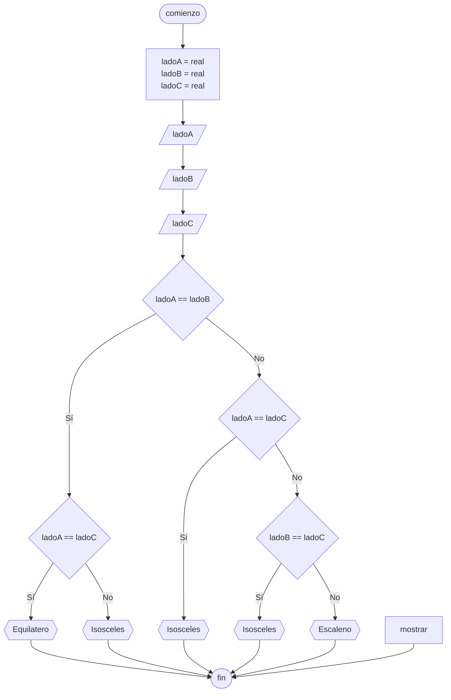

# 20240430 - Tipo de triángulo

Se ingresan los 3 lados de un triángulo, mostrar qué tipo de triángulo es según sus lados.

## Pseudocódigo

```
comienzo

declarar ladoA = real, ladoB = real, ladoC = real

leer(ladoA)
leer(ladoB)
leer(ladoC)

si ladoA == ladoB entonces
    si ladoA == ladoC entonces
        mostrar("Equilatero")
    sino
        mostrar("Isosceles")
sino
    si ladoA == ladoC entonces
        mostrar("Isosceles")
    sino
        si ladoB == ladoC entonces
            mostrar("Isosceles")
        sino
            mostrar("Escaleno")
        fin si
    fin si
fin si

fin
```

## Diagrama de flujo



## Código

```embed-python
PATH: "vault://Algoritmos y Estructuras de Datos/python/20240430-tipo-de-triangulo.py"
```
