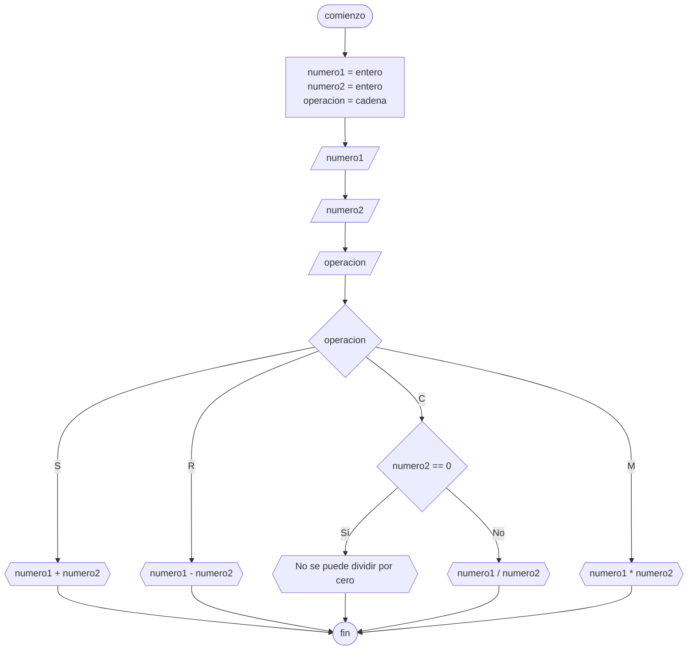

# 20240503 - Operaciones matemáticas

Se ingresan dos números enteros y una letra que representa la operación matemática a resolver ("S" para suma, "R" para resta, "C" para cociente, y "M" para multiplicar). Realizar la operación por la letra y mostrar el resultado.

## Pseudocódigo

```
comienzo

declarar numero1 = entero, numero2 = entero, operacion = cadena

leer(numero1)
leer(numero2)
leer(operacion)

segun_sea operacion hacer:
    "S": mostrar(numero1 + numero2)
    "R": mostrar(numero1 - numero2)
    "C":
        si numero2 == 0 entonces:
            mostrar("No se puede dividir por cero")
        sino:
            mostrar(numero1 / numero2)
    "M": mostrar(numero1 * numero2)
    sino:
    print("Por favor ingrese una operación válida")
fin_segun_sea

fin
```

## Diagrama de flujo



## Código

```embed-python
PATH: "vault://Algoritmos y Estructuras de Datos/python/20240503-operaciones-matematicas.py"
```
