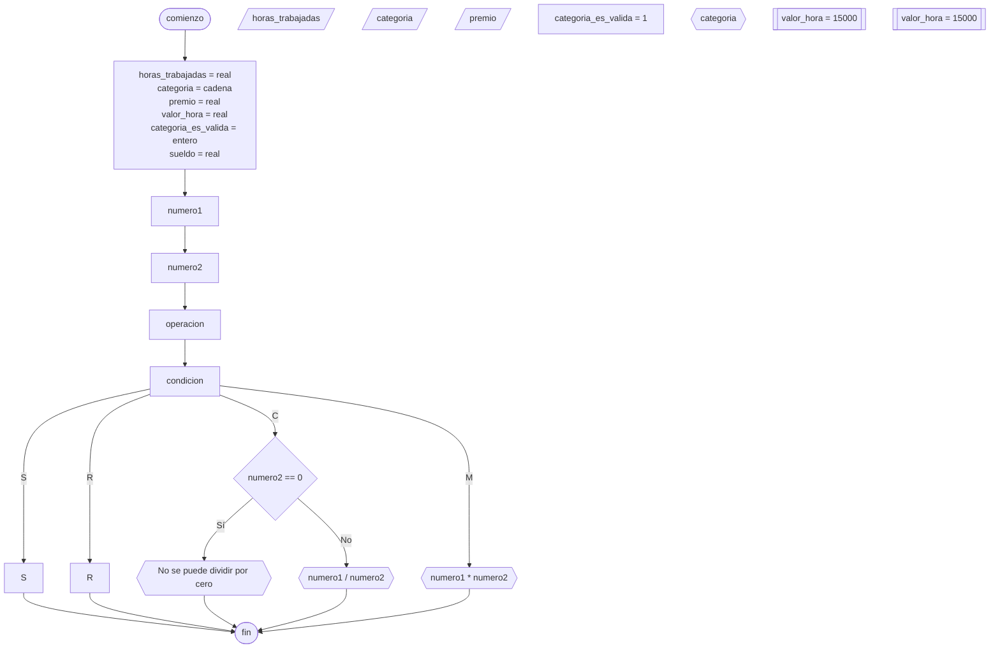

# 20240507 - Sueldo

Se ingresan las horas trabajadas, la categoría (una letra que determina el valor de una hora trabajada de la persona) y el premio que recibe un empleado. Calcular el sueldo, sabiendo que `sueldo = horas * valor_hora + premio`.

| Categoría | Valor hora |
| --------- | ---------- |
| A         | 15000      |
| B         | 10000      |
| C         | 7500       |

Si la categoría ingresada no es valida, no debe calcularse ni mostrarse el sueldo.

## Pseudocódigo

```
comienzo

declarar horas_trabajadas = real, categoria = cadena, premio = real, valor_hora = real, categoria_es_valida = entero, sueldo = real

leer(horas_trabajadas)
leer(categoria)
leer(premio)

categoria_es_valida = 1

segun_sea categoria hacer:
    "A": valor_hora = 15000
    "B": valor_hora = 10000
    "C": valor_hora = 7500
    sino: categoria_es_valida = 0
fin_segun_sea

si categoria_es_valida == 1 entonces
    sueldo = horas_trabajadas * valor_hora + premio
    mostrar(sueldo)
sino
    mostrar("Categoría incorrecta")
fin si

fin
```

## Diagrama de flujo



## Código

```python
# AyED
# Autor: Martín Stanicio
# Fecha: 07/05/2024

horas_trabajadas = 0.0
categoria = ""
premio = 0.0
valor_hora = 0.0
categoria_es_valida = 0
sueldo = 0.0

try:
    horas_trabajadas = float(input("Ingrese las horas trabajadas: "))
    categoria = input("Ingrese la categoría (A, B o C): ")
    premio = float(input("Ingrese el premio: "))
except ValueError:
    print("\nPor favor ingrese números válidos")

categoria_es_valida = 1

match categoria:
    case "A":
        valor_hora = 15000
    case "B":
        valor_hora = 10000
    case "C":
        valor_hora = 7500
    case _:
        categoria_es_valida = 0

if categoria_es_valida == 1:
    sueldo = horas_trabajadas * valor_hora + premio
    print(sueldo)
else:
    print("Categoría incorrecta")
```
