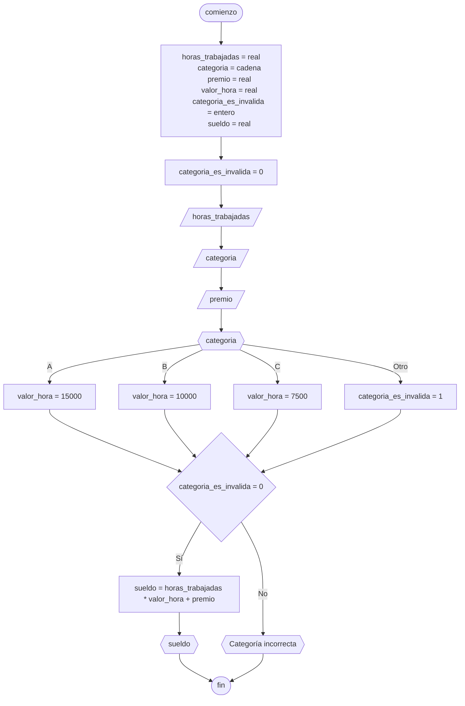

# 20240507 - Sueldo

Se ingresan las horas trabajadas, la categoría (una letra que determina el valor de una hora trabajada de la persona) y el premio que recibe un empleado. Calcular el sueldo, sabiendo que `sueldo = horas * valor_hora + premio`.

| Categoría | Valor hora |
| --------- | ---------- |
| A         | 15000      |
| B         | 10000      |
| C         | 7500       |

Si la categoría ingresada no es valida, no debe calcularse ni mostrarse el sueldo.

## Pseudocódigo

```
comienzo

declarar horas_trabajadas = real, categoria = cadena, premio = real, valor_hora = real, categoria_es_invalida = entero, sueldo = real

leer(horas_trabajadas)
leer(categoria)
leer(premio)

categoria_es_valida = 0

segun_sea categoria hacer:
    "A": valor_hora = 15000
    "B": valor_hora = 10000
    "C": valor_hora = 7500
    sino: categoria_es_invalida = 1
fin_segun_sea

si categoria_es_invalida == 0 entonces
    sueldo = horas_trabajadas * valor_hora + premio
    mostrar(sueldo)
sino
    mostrar("Categoría incorrecta")
fin si

fin
```

## Diagrama de flujo



## Código

```embed-python
PATH: "vault://Algoritmos y Estructuras de Datos/python/20240507-sueldo.py"
```
