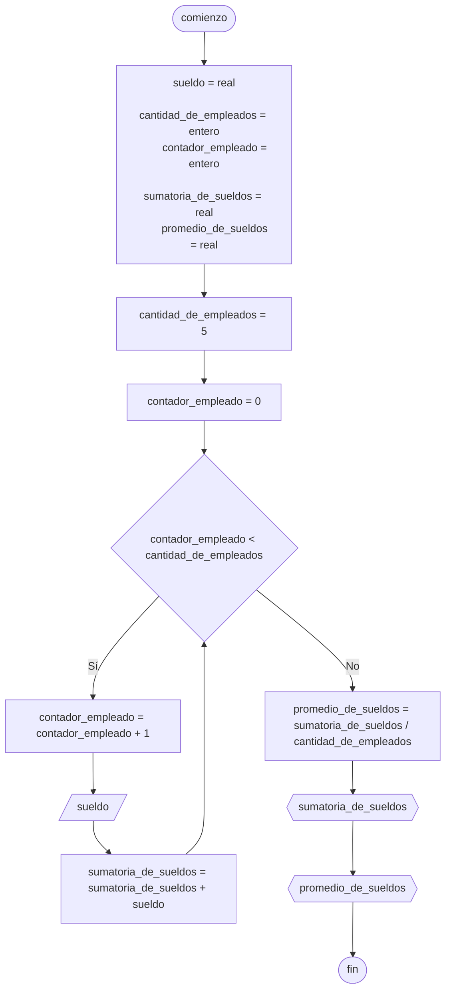

# 20240510 - Deportistas

Se ingresan los datos de los deportistas: apellido, edad, sexo (El sexo es una letra, M o H). Hallar:

- Cantidad de personas ingresadas
- Cantidad de hombres
- Cantidad de mujeres
- Promedio de edad de las personas

## Pseudocódigo

```
comienzo

declarar cantidad_de_deportistas = entero, cantidad_de_hombres = entero, cantidad_de_mujeres = entero, sumatoria_de_edad = entero, promedio_de_edad = real, continuar = cadena, apellido = cadena, edad = entero, sexo = cadena

cantidad_de_deportistas = 0
continuar = ""
cantidad_de_hombres = 0
cantidad_de_mujeres = 0
sumatoria_de_edad = 0

mientras continuar != "no" entonces
    leer(apellido)
    leer(edad)
    leer(sexo)
    
    cantidad_de_deportistas = cantidad_de_deportistas + 1
    
    segun_sea sexo entonces
        "H": cantidad_de_hombres = cantidad_de_hombres + 1
        "M": cantidad_de_mujeres = cantidad_de_mujeres + 1
        sino: mostrar("Sexo no contemplado")
    
    sumatoria_de_edad = sumatoria_de_edad + edad

promedio_de_edad = sumatoria_de_edad / cantidad_de_deportistas

mostrar(cantidad_de_deportistas)
mostrar(cantidad_de_hombres)
mostrar(cantidad_de_mujeres)
mostrar(promedio_de_edad)

fin
```

## Diagrama de flujo



## Código

```embed-python
PATH: "vault://Algoritmos y Estructuras de Datos/python/20240510-deportistas.py"
```
