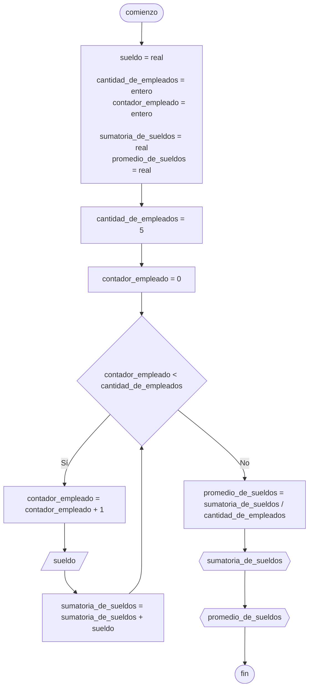

# 20240510 - Sueldos

Se ingresan los sueldos de 5 empleados. Hallar:

- Sumatoria de sueldos
- Promedio de sueldos

## Pseudocódigo

```
comienzo

declarar sueldo = real, cantidad_de_empleados = entero, contador_empleado = entero, sumatoria_de_sueldos = real, promedio_de_sueldos = real

cantidad_de_empleados = 5
contador_empleado = 0

mientras contador_empleado < cantidad_de_empleados entonces
    contador_empleado = contador_empleado + 1
    
    leer(sueldo)
    
    sumatoria_de_sueldos = sumatoria_de_sueldos + sueldo

promedio_de_sueldos = sumatoria_de_sueldos / cantidad_de_empleados

mostrar(sumatoria_de_sueldos)
mostrar(promedio_de_sueldos)

fin
```

## Diagrama de flujo



## Código

```embed-python
PATH: "vault://Algoritmos y Estructuras de Datos/python/20240510-sueldos.py"
```
