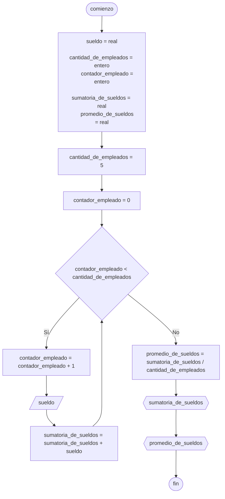

# 20240514 - Producción

Se ingresan los datos de producción de una empresa de cerámicos:

- Fecha de producción (cadena de la forma `dd/mm/aaaa`)
- Toneladas producidas
- Turno de producción ("M" para mañana o "T" para tarde)

Hallar:

- Total de toneladas producidas en el turno mañana
- Total de toneladas producidas en el turno tarde

La última producción tiene como toneladas producidas $-9999$ y no se debe procesar. Usar un [[Ciclo mientras]] controlado con [[Valor centinela]]

## Pseudocódigo

```
comienzo

declarar toneladas_producidas_manana = real, toneladas_producidas_tarde = real, toneladas_producidas_turno = real, fecha_produccion = cadena, turno_produccion = cadena

toneladas_producidas_manana = 0
toneladas_producidas_tarde = 0

leer(toneladas_producidas_turno)

mientras toneladas_producidas_turno != -9999 entonces
    si toneladas_producidas_turno != -9999 entonces
        leer(fecha_produccion)
        leer(turno_produccion)
        
        segun_sea turno_produccion entonces
            "M": toneladas_producidas_manana = toneladas_producidas_manana + toneladas_producidas_turno
            "T": toneladas_producidas_tarde = toneladas_producidas_tarde + toneladas_producidas_turno
        fin_segun_sea
        
        leer(toneladas_producidas_turno)
    fin_si
fin_mientras

mostrar(toneladas_producidas_manana)
mostrar(toneladas_producidas_tarde)

fin
```

## Diagrama de flujo



## Código

```embed-python
PATH: "vault://Algoritmos y Estructuras de Datos/python/20240514-produccion.py"
```
