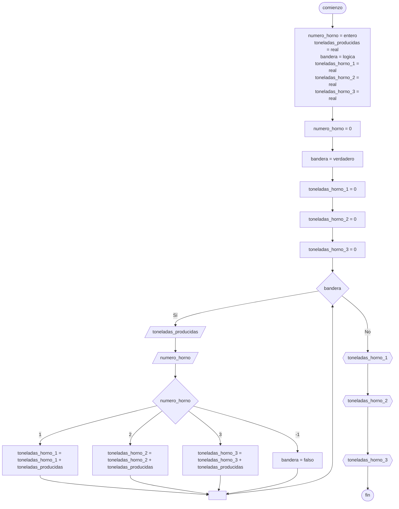

# 20240517 - Producciones

Se ingresan los datos de producciones:

- Número de horno ($1$, $2$ o $3$)
- Toneladas producidas

Mostrar total de toneladas producidas por cada horno.

La última producción tiene como número de horno $-1$ y no debe procesarse.

Usar un [[Ciclo mientras]] controlado por [[Bandera]].

## Pseudocódigo

```
comienzo

declarar numero_horno = entero, toneladas_producidas = real, bandera = logica, toneladas_horno_1 = real, toneladas_horno_2 = real, toneladas_horno_3 = real

numero_horno = 0
bandera = verdadero
toneladas_horno_1 = 0
toneladas_horno_2 = 0
toneladas_horno_3 = 0

mientras bandera entonces
    leer(toneladas_producidas)
    leer(numero_horno)
    
    segun_sea numero_horno entonces
        1: toneladas_horno_1 = toneladas_horno_1 + toneladas_producidas
        2: toneladas_horno_2 = toneladas_horno_2 + toneladas_producidas
        3: toneladas_horno_3 = toneladas_horno_3 + toneladas_producidas
        -1: bandera = falso
    fin_segun_sea
fin_mientras

mostrar(toneladas_horno_1)
mostrar(toneladas_horno_2)
mostrar(toneladas_horno_3)

fin
```

## Diagrama de flujo



## Código

```embed-python
PATH: "vault://Algoritmos y Estructuras de Datos/python/20240517-producciones.py"
```
