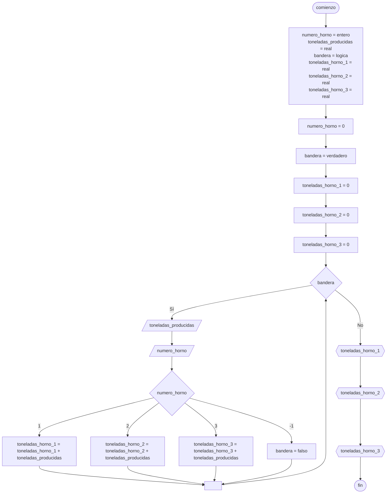

# 20240521 - Club

Se ingresa con opción a continuar los datos de los socios de un club:

- N° de socio
- Categoría (A, B o C)
- Sexo (H o M)
- Edad

Hallar:

- Cantidad de hombres, mujeres, y total de personas por cada categoría
- Promedio de edad de los hombres y las mujeres
- Mayor número de socio par
- Menor número de socio impar
- Mostrar la categoría que tiene la mayor cantidad de personas

Usar un [[Ciclo repetir-hasta]].

## Pseudocódigo

```
comienzo

declarar numero_socio = entero, categoria = cadena, sexo = cadena, edad = entero, cantidad_personas_A = entero, cantidad_personas_B = entero, cantidad_personas_C = entero, cantidad_hombres_A = entero, cantidad_hombres_B = entero, cantidad_hombres_C = entero, cantidad_mujeres_A = entero, cantidad_mujeres_B = entero, cantidad_mujeres_C = entero, promedio_edad_hombres = real, promedio_edad_mujeres = real, mayor_numero_socio_par = entero, menor_numero_socio_impar = entero, categoria_mayor_personas = cadena, continuar = cadena, edad_hombres = entero, edad_mujeres = entero, promedio_edad_hombres = real, promedio_edad_mujeres = te

cantidad_hombres_A = 0
cantidad_hombres_B = 0
cantidad_hombres_C = 0
cantidad_mujeres_A = 0
cantidad_mujeres_B = 0
cantidad_mujeres_C = 0
mayor_numero_socio_par = -9999999
menor_numero_socio_impar = 1000000
continuar = "no"

repetir
    leer(numero_socio)
    leer(categoria)
    leer(sexo)
    leer(edad)
    
    si numero_socio % 2 == 0 y numero_socio > mayor_numero_socio_par entonces
        mayor_numero_socio_par = numero_socio
    
    si numero_socio % 2 != 0 y numero_socio < menor_numero_socio_impar entonces
        mayor_numero_socio_par = numero_socio
    
    segun_sea categoria entonces
        "A":
            si sexo == "H" entonces
                cantidad_hombres_A = cantidad_hombres_A + 1
            sino
                cantidad_mujeres_A = cantidad_mujeres_A + 1
            fin_si
        "B":
            si sexo == "H" entonces
                cantidad_hombres_B = cantidad_hombres_B + 1
            sino
                cantidad_mujeres_B = cantidad_mujeres_B + 1
            fin_si
        "C":
            si sexo == "H" entonces
                cantidad_hombres_C = cantidad_hombres_C + 1
            sino
                cantidad_mujeres_C = cantidad_mujeres_C + 1
            fin_si
    fin_segun_sea
    
    leer(continuar)
hasta continuar == "no"

cantidad_personas_A = cantidad_hombres_A + cantidad_mujeres_A
cantidad_personas_B = cantidad_hombres_B + cantidad_mujeres_B
cantidad_personas_C = cantidad_hombres_C + cantidad_mujeres_C

promedio_edad_hombres = ()

fin
```

## Diagrama de flujo


