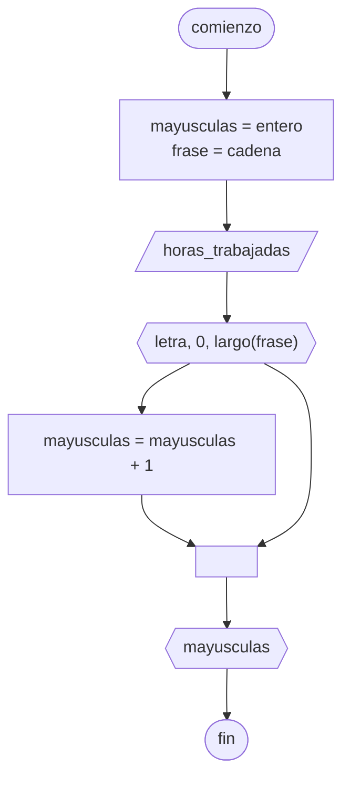

# 20240705 - Mayúsculas

Se ingresa una frase desde teclado, mostrar la cantidad de letras mayúsculas.

## Diagrama de flujo



## Código

```embed-python
PATH: "vault://Algoritmos y Estructuras de Datos/python/20240705-mayusculas.py"
```
