# 20240712 - Fecha

Generar una nueva fecha 15 días después de una fecha ingresada.

## Diagrama de flujo

```mermaid
flowchart TB
	comienzo([comienzo])
    
	variables["`fecha_ingresada = cadena
	dias_a_sumar = entero
	dia = entero
	mes = entero
	año = entero
	dias_del_mes = entero
	dia_calculado = entero
	dia_final = entero
    mes_final = entero
    año_final = entero
    dia_cadena = cadena
    mes_cadena = cadena
    año_cadena = cadena
    fecha_final = cadena`"]
    
	fecha_ingresada[/fecha_ingresada/]
	dias_a_sumar["dias_a_sumar = 15"]
    
    partes_de_fecha_inicial["`dia = entero(fecha_ingresada[0:2])
    mes = entero(fecha_ingresada[3:5])
    año = entero(fecha_ingresada[6:10])`"]
    
    partes_de_fecha_final["`mes_final = mes
    año_final = año`"]
    
    match{mes}
    
    dias_del_mes_31["dias_del_mes = 31"]
    dias_del_mes_30["dias_del_mes = 30"]
    dias_del_mes_28["dias_del_mes = 28"]
    
    dia_calculado["dia_calculado = dia + dias_a_sumar"]
    
    if{"dia_calculado > dias_del_mes"}
    
    if_si["`dia_final = dia_calculado - dias_del_mes
    mes_final = (mes RESTO 12) + 1`"]
    
    if_si_if{"mes_final == 1"}
    
    año_final["año_final = año_final + 1"]
    
    if_no["dia_final = dia_calculado"]
    
    dia_cadena{"dia_final >= 10"}
    dia_cadena_si["dia_cadena = cadena(dia_final)"]
    dia_cadena_no["dia_cadena = '0' + cadena(dia_final)"]
    
    mes_cadena{"mes_final >= 10"}
    mes_cadena_si["mes_cadena = cadena(mes_final)"]
    mes_cadena_no["mes_cadena = '0' + cadena(mes_final)"]
    
    año_cadena["año_cadena = cadena(año_final)"]
    
    fecha_final["dia_cadena + '/' + mes_cadena + '/' + año_cadena"]
    
    mostrar{{"fecha_final"}}
    
    A[" "]
    B[" "]
    C[" "]
    D[" "]
    E[" "]
        
	fin([fin])
    
	comienzo --> variables --> fecha_ingresada --> dias_a_sumar --> partes_de_fecha_inicial --> partes_de_fecha_final --> match
	match -- "1 | 3 | 5 | 7 | 8 | 10 | 12" --> dias_del_mes_31 --> A
	match -- "4 | 6 | 9 | 11" --> dias_del_mes_30 --> A
	match -- "2" --> dias_del_mes_28 --> A
	A --> dia_calculado --> if
	if -- "Sí" --> if_si --> if_si_if
	if_si_if -- "Sí" --> año_final --> B
	if_si_if -- "No" --> B
	if -- "No" --> if_no --> C
	B --> C --> dia_cadena
	dia_cadena -- "Sí" --> dia_cadena_si --> D
	dia_cadena -- "No" --> dia_cadena_no --> D
	D --> mes_cadena
	mes_cadena -- "Sí" --> mes_cadena_si --> E
	mes_cadena -- "No" --> mes_cadena_no --> E
	E --> año_cadena --> fecha_final --> mostrar --> fin
```



## Código

```embed-python
PATH: "vault://Algoritmos y Estructuras de Datos/python/20240712-fecha.py"
```
