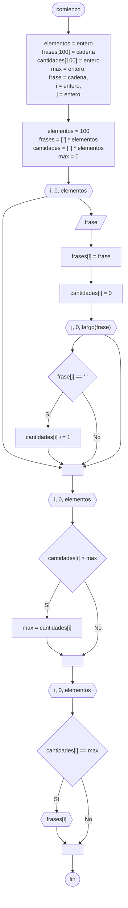

# 20240809 - Frases

Se ingresan 100 frases desde el teclado, mostrar las frases que tienen la mayor cantidad de palabras

## Diagrama de flujo



## Código

```embed-python
PATH: "vault://Algoritmos y Estructuras de Datos/python/20240809-frases.py"
```
