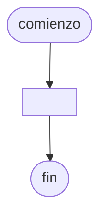

# 20240809 - Invertir

Se tiene un vector de 100 elementos cargado con números enteros, diseñar una función que recibe como parámetro a dicho vector y deberá retornar el mismo vector con los contenidos en el órden inverso.

## Diagrama de flujo



## Código

```embed-python
PATH: "vault://Algoritmos y Estructuras de Datos/python/20240809-invertir.py"
```
