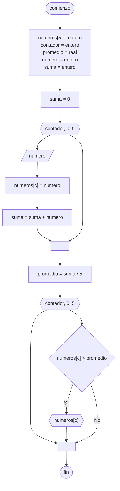

# 20240809 - Promedio

Se ingresan 5 números, mostrar el promedio y los números mayores al mismo.

## Pseudocódigo

```
comienzo

declarar elementos = entero, numeros[5] = real, suma = real, promedio = real


fin
```

## Diagrama de flujo



## Código

```embed-python
PATH: "vault://Algoritmos y Estructuras de Datos/python/20240809-promedio.py"
```
