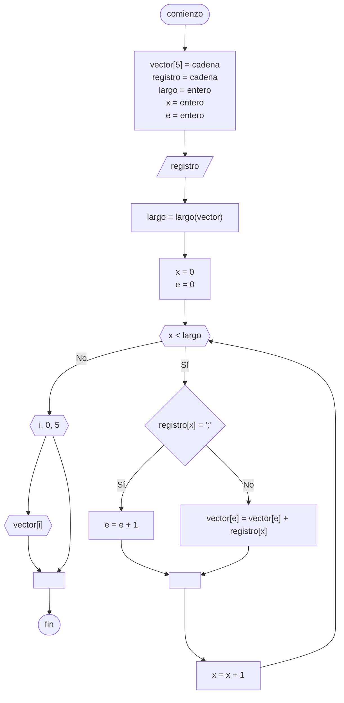

# 20240820 - Apellidos

## Diagrama de flujo


```mermaid
flowchart TB
	comienzo([comienzo])
    
	variables["`vector[5] = cadena
	registro = cadena
	largo = entero
	x = entero
	e = entero
	`"]
	
	registro[/registro/]
	largo["largo = largo(vector)"]
	inicializar["`x = 0
	e = 0`"]
	
	while{{"x < largo"}}
	if{"registro[x] = ';'"}
	e["e = e + 1"]
	concatenar["vector[e] = vector[e] + registro[x]"]
	
	x["x = x + 1"]
	
	for{{"i, 0, 5"}}
	
	mostrar{{"vector[i]"}}
    
    fin([fin])
    
    a[" "]
    b[" "]
    
	comienzo --> variables --> registro --> largo --> inicializar --> while
	while -- Sí --> if
	while -- No --> for
	if -- Sí --> e --> a
	if -- No --> concatenar --> a
	a ---> x ---> while
	for --> mostrar --> b
	for --> b
	b --> fin
```

## Código

```embed-python
PATH: "vault://Algoritmos y Estructuras de Datos/python/20240820-apellidos.py"
```
