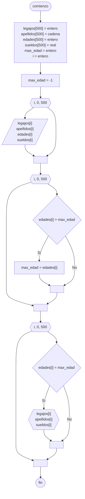

# 20240820 - Empleados

Se ingresan los datos de 500 empleados:

- Legajo
- Apellido
- Edad
- Sueldo

Mostrar legajo, apellido y sueldo de las personas que tienen la mayor edad

## Diagrama de flujo



## Código

```embed-python
PATH: "vault://Algoritmos y Estructuras de Datos/python/20240820-empleados.py"
```
