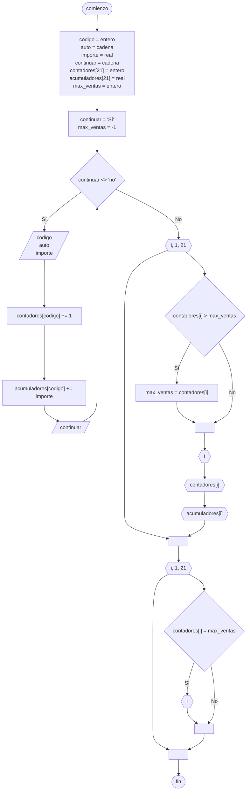

# 20240823 - Vector contador y acumulador

Se ingresa con opción a continuar las ventas realizadas por distintos vendedores de una empresa automotriz:

- Código de vendedor (entero)
- Auto (cadena)
- Importe (real)

El código de vendedor es un número entre 1 y 20

Mostrar:

- Cantidad de ventas realizadas por cada vendedor
- Total de importe facturado por cada vendedor 
- Código de vendedor con más ventas (puede repetirse)

## Diagrama de flujo



## Código

```embed-python
PATH: "vault://Algoritmos y Estructuras de Datos/python/20240823-vector-contador-acumulador.py"
```
