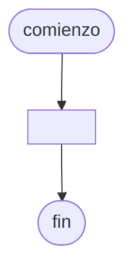

# 20240823 - Vectores paralelos

Se ingresan los [[Dato|Datos]] de 2000 deportistas de un club.

- Apellido (cadena)
- Nombre (cadena)
- Edad (entero)
- Peso (real)

Mostrar

- Apellido y nombre de los deportistas que tienen la mayor edad.
- Apellido, nombre y edad de los deportistas cuyo peso es menor al peso promedio.

## Diagrama de flujo



## Código

```embed-python
PATH: "vault://Algoritmos y Estructuras de Datos/python/20240823-vectores-paralelos.py"
```
