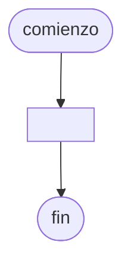

# 20240827 - Ordenamiento por inserción
Se ingresa con opción a continuar las producciones de distintas sucursales de una empresa:
- Número de sucursal (entero)
- Toneladas producidas (real)
- Fecha de producción (cadena)

Mostrar:
- Total de toneladas producidas por cada número de sucursal
- Cantidad de produc
## Diagrama de flujo



## Código

```embed-python
PATH: "vault://Algoritmos y Estructuras de Datos/python/20240827-actividad.py"
```
