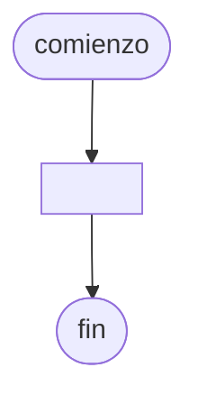

# 20240827 - Ordenamiento por inserción

Se ingresa con opción a continuar las producciones de distintas sucursales de una empresa:

- Número de sucursal (entero, 1-15)
- Toneladas producidas (real)
- Fecha de producción (cadena)

Mostrar:

- Total de toneladas producidas por cada número de sucursal
- Cantidad de producciones por cada número de sucursal
- Promedio de toneladas producidas por cada número de sucursal
- Número de sucursales con el mayor total de toneladas producidas (repetido)
- Total de toneladas producidas por cada mes

## Diagrama de flujo



## Código

```embed-python
PATH: "vault://Algoritmos y Estructuras de Datos/python/20240827-actividad.py"
```
