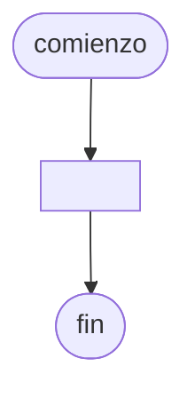

# 20240903 - Cantidad de palabras

Realizar una función llamada `cantidadPalabras` con las siguientes características:

- Recibe como parámetro a `frases` que es un vector de 100 elementos del tipo string.
- Debera retornar al programa principal un vector de 100 elementos del tipo entero con la cantidad de palabras que hay en cada elemento del vector `frases` que recibe como parámetro de entrada.

## Diagrama de flujo



## Código

```embed-python
PATH: "vault://Algoritmos y Estructuras de Datos/python/20240903-cantidad-de-palabras.py"
```
