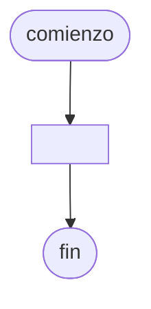

# 20240903 - Mayor antiguedad

Se ingresan con opción a continuar los datos de los empleados de una empresa:

- Legajo (entero)
- Sueldo (real)
- FechaIngreso (cadena dd/mm/aaaa)

Mostar el legajo y el sueldo de la persona con mayor antiguedad (fecha de ingreso más antigua).

## Diagrama de flujo



## Código

```embed-python
PATH: "vault://Algoritmos y Estructuras de Datos/python/20240903-mayor-antiguedad.py"
```
