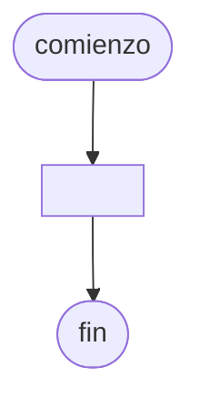

# 20240903 - Micros

Se ingresa con opción a continuar los datos de los viajes realizados por una empresa de micros a larga distacia. Cada viaje está compuesto por los siguientes datos:

- NroMicro (entero)
- Destino (cadena)
- Fecha (cadena dd/mm/aaaa)
- Pasajeros (entero)

El código de micro está comprendido entre: 1-20.

Mostrar:

- Cantidad de viajes realizados por cada número de micro.
- Total de pasajeros transportados por cada número de micro.
- Número de micro con la mayor cantidad de viajes realizados (puede ser un máximo repetido).
- Número de micro con la menor cantidad de viajes realizados (puede ser un mínimo repetido).

## Diagrama de flujo



## Código

```embed-python
PATH: "vault://Algoritmos y Estructuras de Datos/python/20240903-micros.py"
```
