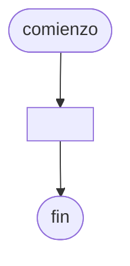

# 20240903 - Ventas

Se ingresa con opción a continuar los datos de las ventas realizadas por distintos vendedores de una empresa:
- NroVendedor (entero)
- NroFactura (entero)
- FechaVenta (cadena dd/mm/aaaa)
- ImporteFactura (real)

El código de vendedor está comprendido entre: 1-30.
Mostrar:
- Cantidad de ventas realizadas por cada número de vendedor.
- Total de importe facturado por cada número de vendedor.
- Pormedio de importe facturado por cada número de vendedor.
## Diagrama de flujo



## Código

```embed-python
PATH: "vault://Algoritmos y Estructuras de Datos/python/20240903-ventas.py"
```
