# 20240909 - Alumnos

Se ingresa a una base de datos el apellido de cada alumno, legajo, fecha de nacimiento y nota de parcial. Mostrar:

- Apellido, legajo y mes de nacimiento de los alumnos con la mayor nota ([[Mínimo|Máximo]] repetido)
- Todas las notas y cuantas veces se repiten

Para el diagrama, considerar 150 alumnos.

## Diagrama de flujo

```mermaid
flowchart TB
	comienzo([comienzo])
    
	variables1["`apellidos[150] = cadena
	legajos[150] = entero
	nacimientos[150] = cadena
	notas[150] = real
	i = entero
	max_nota = real
	mes = cadena`"]
	inicializar1["max_nota = -1.0"]
	
	for1{{"i, 1, 151"}}
	mostrar1{{"Alumno i"}}
	input[/"`apellidos[i]
	legajos[i]
	nacimientos[i]
	notas[i]`"/]
	if1{"notas[i] > max_nota"}
	if1si["max_nota = notas[i]"]
	
	mostrar2{{"Nota máxima: max_nota"}}
	
	for2{{"i, 1, 151"}}
	if2{"notas[i] = max_nota"}
	mes["mes = nacimientos[i][4:6]"]
	mostrar3{{"Apellido apellidos[i], Legajo legajos[i], Mes mes"}}
	    
    insertion_sort(["insertion_sort(vector)"])
    
    variables2["`n = entero
    i = entero
    j = entero
    aux = real`"]
    inicializar2["n = largo(vector)"]
    
    for3{{"i, 1, n"}}
    for4{{"j, i + 1, n + 1"}}
    if3{"vector[i] > vector[j]"}
    swap["`aux = vector[i]
    vector[i] = vector[j]
    vector[j] = aux`"]
    
    retornar(["retornar vector"])
    
    variables3["`notas_ordenadas[150] = real
    control = real
    z = entero
    nota = real`"]
    inicializar3["`notas_ordenadas = insertion_sort(notas)
    control = notas_ordenadas[1]
    z = 0`"]
    for5{{"i, 1, 151"}}
    nota["nota = notas_ordenadas[i]"]
    if4{"control = nota"}
    if4si["z = z + 1"]
    mostrar4{{"La nota control se repite z veces"}}
    if4no["`control = nota
    z = 1`"]
    
    mostrar5{{"La nota control se repite z veces"}}
    
    fin([fin])
    
    a[" "]
    b[" "]
    c[" "]
    d[" "]
    e[" "]
    f[" "]
    g[" "]
    h[" "]
    i[" "]
    
	comienzo --> variables1 --> inicializar1 --> for1 --> mostrar1 --> input --> if1
	if1 -- "Sí" --> if1si --> a
	if1 -- "No" --> a
	a --> b
	for1 --> b --> mostrar2 --> for2 --> if2
	if2 -- "Sí" --> mes --> mostrar3 --> c
	if2 -- "No" --> c
	c --> d
	for2 --> d --> variables3 --> inicializar3 --> for5 --> nota --> if4
	if4 -- "Sí" --> if4si --> e
	if4 -- "No" --> mostrar4 --> if4no --> e
	e --> f
	for5 --> f --> mostrar5 --> fin
	
	insertion_sort --> variables2 --> inicializar2 --> for3 --> for4 --> if3
	if3 -- "Sí" --> swap --> g
	if3 -- "No" --> g
	g --> h --> i
	for4 --> h
	for3 --> i --> retornar
```



## Código

```embed-python
PATH: "vault://Algoritmos y Estructuras de Datos/python/20240909-alumnos.py"
```
