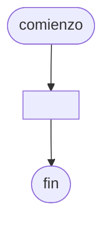

# 20240909 - Números más grandes

Se ingresan 40 números enteros y distintos. Mostrar los 4 números más grandes.

## Diagrama de flujo



## Código

```embed-python
PATH: "vault://Algoritmos y Estructuras de Datos/python/20240909-numeros-mas-grandes.py"
```
