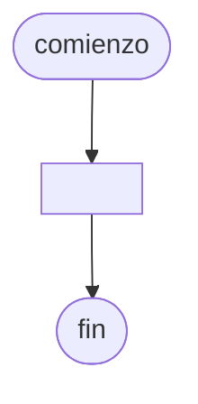

# 20240909 - Procedimiento para frases

Realizar un [[Procedimiento]] llamado `info_frases` que reciba como [[Parámetros|Parámetro]] a `frases`, que es un [[Vector|Vector]] cargado de 100 elementos del tipo cadena. Dicho [[Vector|Vector]] se encuentra cargado con frases.

Deberá devolver al programa principal:

- [[Vector|Vector]] de 100 elementos del tipo entero con la cantidad de palabras que hay en cada elemento del [[Vector|Vector]] `frases` que recibe como [[Parámetros|Parámetro]] de [[Entradas|Entrada]].
- [[Vector|Vector]] de 100 elementos del tipo entero con la cantidad de vocales que hay en cada elemento del [[Vector|Vector]] `frases` que recibe como [[Parámetros|Parámetro]] de [[Entradas|Entrada]].

## Diagrama de flujo



## Código

```embed-python
PATH: "vault://Algoritmos y Estructuras de Datos/python/20240909-procedimiento-para-frases.py"
```
