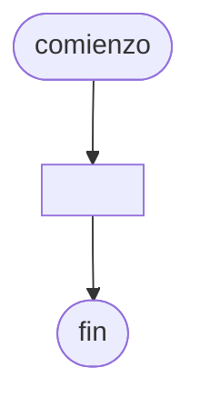

# 20240909 - Socios

Se ingresan los [[Dato|Datos]] de 4000 socios de un club, a saber:

- Número de socio (entero)
- Apellido (cadena)
- Edad (entero)

Imprimir el número de socio y apellido de aquellos que tienen la menor edad ([[Mínimo]] repetido).

## Diagrama de flujo



## Código

```embed-python
PATH: "vault://Algoritmos y Estructuras de Datos/python/20240909-socios.py"
```
