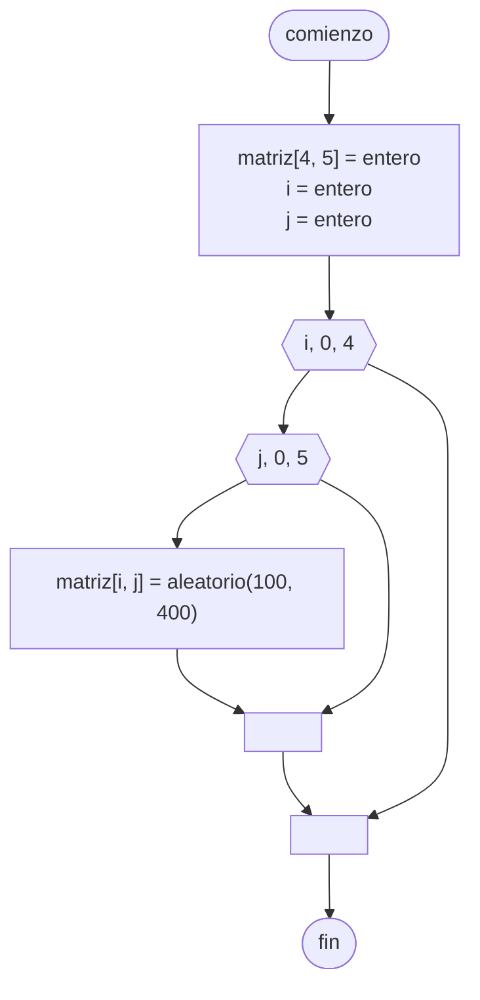

# 20240924 - Matriz aleatoria

Cargar una [[Vector multidimensional|Matriz]] de $4 \times 5$ con números aleatorios comprendidos en $[100, 400]$ cargando por fila.

## Diagrama de flujo



## Código

```embed-python
PATH: "vault://Algoritmos y Estructuras de Datos/python/20240924-matriz-aleatoria.py"
```
	