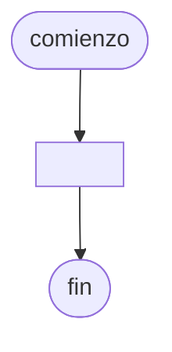

# 20240924 - Total por fila

Se ingresa una [[Vector multidimensional|Matriz]] cuadrada de $50 \times 50$. Mostrar el número de fila que tiene el mayor total.

## Diagrama de flujo



## Código

```embed-python
PATH: "vault://Algoritmos y Estructuras de Datos/python/20240924-total-por-fila.py"
```
