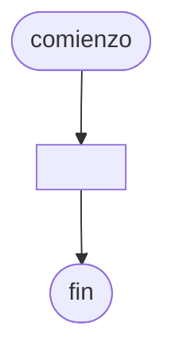

# 20240927 - Matriz acumulador contador

Se ingresa con opción a continuar las producciones realizadas por las distintas sucursales de una empresa:

- Número de sucursal: entero (1-4)
- Fecha de producción: cadena
- Toneladas producidas: real

Mostrar:

- Cantidad de producciones por horno por sucursal
- Total producido por horno por sucursal
- Total producido por sucursal
- Número de sucursal con el mayor total de toneladas producidas (repetido)

## Diagrama de flujo



## Código

```embed-python
PATH: "vault://Algoritmos y Estructuras de Datos/python/20240927-matriz-acumulador-contador.py"
```
