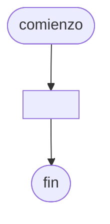

# 20241022 - Deportistas

El usuario ingresa el deporte cuyas estadísticas queremos analizar. Mostrar:

- Cantidad de deportistas que practican ese deporte
- Promedio de altura de las personas que practican ese deporte
- Mayor edad de la persona que practica ese deporte

Cada registro del archivo `deportistas.txt` contiene los siguientes campos:

- Número de socio (entero)
- Apellido (cadena)
- Altura (real)
- Edad (entero)
- Deporte (cadena): "f", "b" o "v"

## Diagrama de flujo



## Código

```embed-python
PATH: "vault://Algoritmos y Estructuras de Datos/python/20241022-deportistas/main.py"
```

```embed-shell
PATH: "vault://Algoritmos y Estructuras de Datos/python/20241022-deportistas/deportistas.txt"
```
